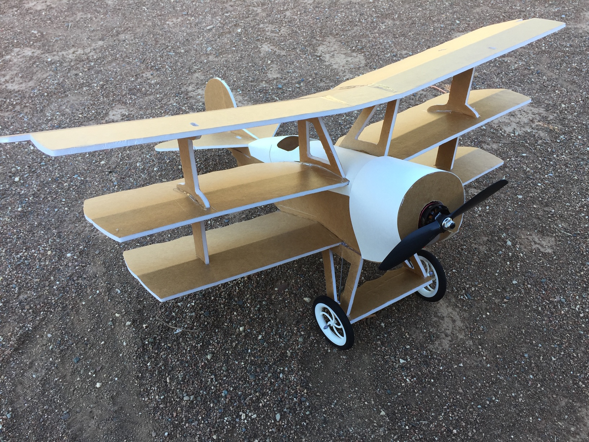

# FT Mini DR1

January 2019

## Specifications

Weight Without Battery: 9.3 oz 

Wingspan: 24 Inches (736mm)

Center of Gravity: Directly on the fold of the top wing

Control Surface Throws: 12 Degrees

Expo Suggestions: 30%

Recommended Motor: 2204-2205 Size; 2400kV Minimum

Recommended Propellers: 6x4.5

Recommended ESC: 20-30 Amp

Recommended Battery: 3S 11.1V LiPo 800mAh

Recommended Servos: ~5 Gram Micro Servos

## Plans

[FT Mini DR1 Plans](../../assets/rc-airplanes/dr1/plans.pdf)
