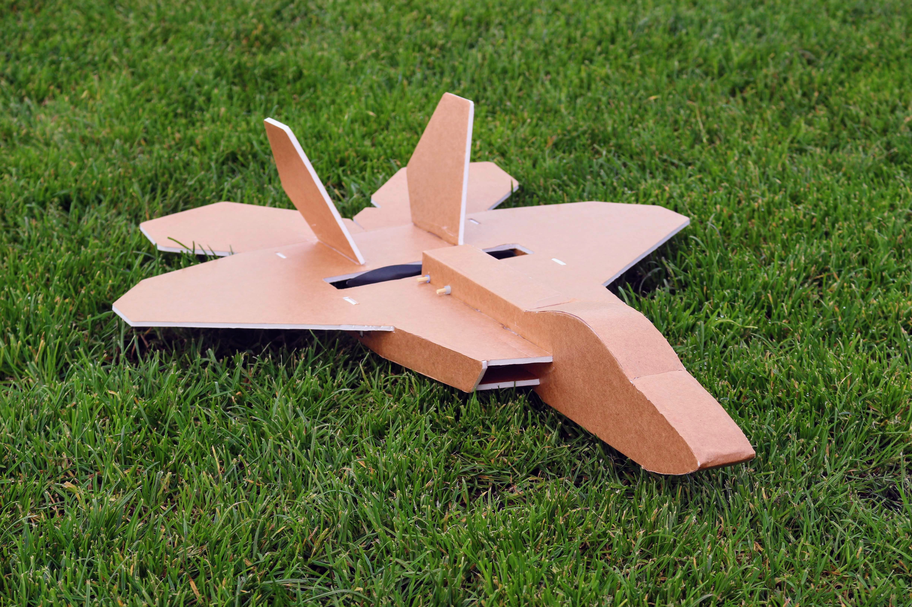

import ReactPlayer from 'react-player'

# FT Mini F-22

January 2019

## Video

    <ReactPlayer className="video_player" controls height="100%" width="100%" url="https://www.youtube.com/watch?v=09-1-q6_8yc"/>

## Specifications

Weight Without Battery: 5 Oz 

Wingspan: 20 Inches (508mm)

Center of Gravity: 14 Inches (355mm) from the nose (Recommended)

Control Surface Throws: 25 Degrees

Expo Suggestions: 30%

Recommended Motor: 2204-2206 Size; 2200kV minimum

Recommended Propellers: 6x4.5

Recommended ESC: 20 Amp

Recommended Battery: 3S 11.1V LiPo 800mAh

Recommended Servos: ~5 Gram Micro Servos

## Plans

[FT Mini F-22 Plans](../../assets/rc-airplanes/f22/plans.pdf)
