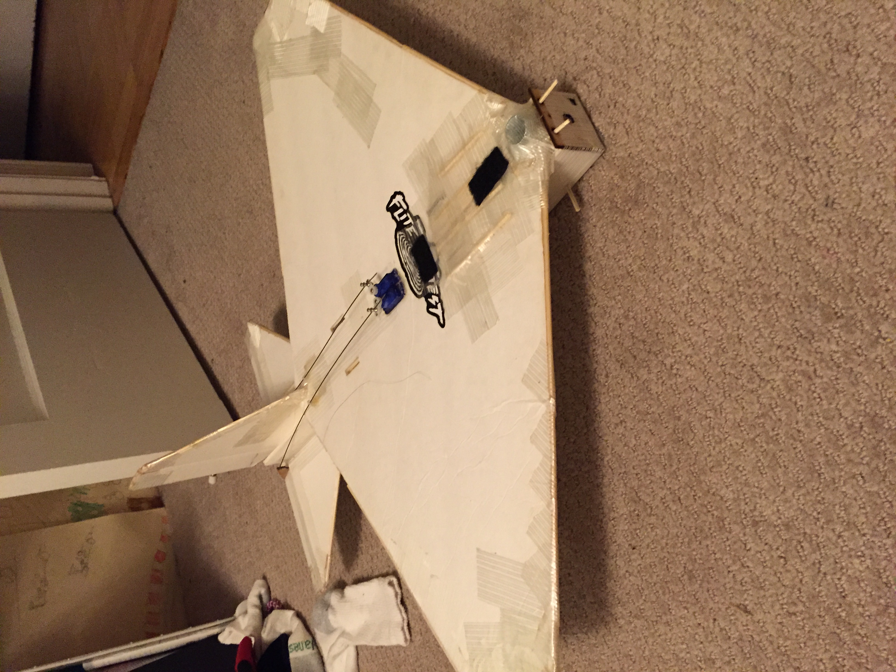

# FT Flyer

February 2015

## Specifications

Wingspan: 760mm

Flying Weight: 450g

Recommended Motor: 2205-2306 Size (2300-2700kV) 

Recommended ESC: EMX-SC-0099

Recommended Servos: FLT-3032

Recommended Battery: 11.1-14.8V 1300-2200mAh 3s-4s LiPo Battery

Recommended Propeller: 5x5x3

## Plans

[FT Flyer Plans](../../assets/rc-airplanes/flyer/plans.pdf)
