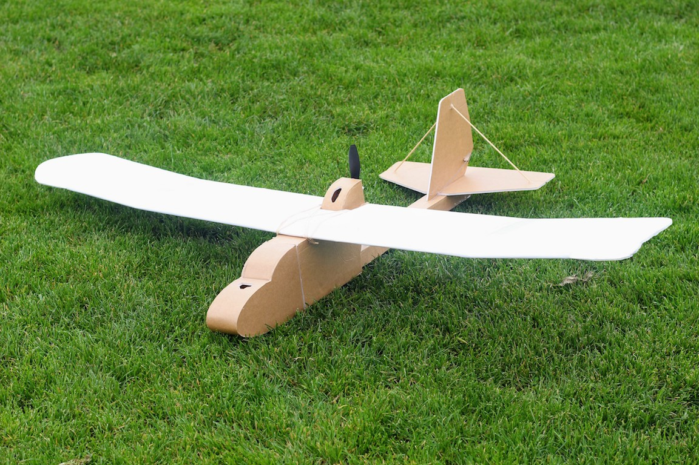

import ReactPlayer from 'react-player'

# FT Explorer

November 2017

## Video

    <ReactPlayer className="video_player" controls height="100%" width="100%" url="https://www.youtube.com/watch?v=poedh6mf1UQ"/>

## Specifications

Weight Without Battery: 1.08 lbs (493 g)

Center of Gravity: 2.25” (57 mm) from leading edge of wing

Control Surface Throws: 12˚ deflection - Expo 30%

Wingspan: 57 inches (1447 mm)

Recommended Motor: Park 370 – 425, 1000 kv minimum

Recommended Prop: 8 x 4.5 slow fly or 9 x 6 APC prop

Recommended ESC: 20 – 30 amp

Recommended Battery: 2200 mAH 3s minimum 

Recommended Servos: (2 – 4) 9 gram servos

## Plans

[FT Explorer Plans](../../assets/rc-airplanes/ft-explorer/ft_explorer_plans.pdf)
