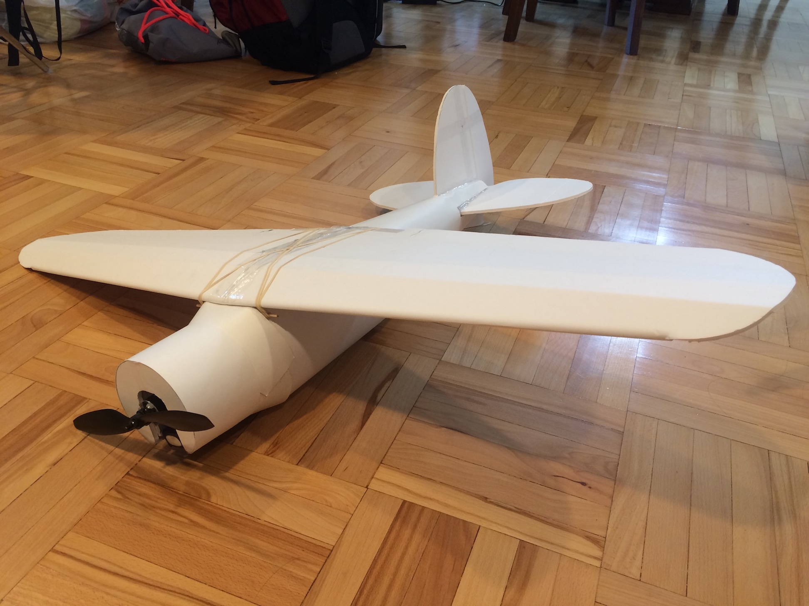

import ReactPlayer from 'react-player'

# Lockheed Vega

December 2018 - July 2020

:::info
Check out the documentation on the: **[FliteTest Forums](https://forum.flitetest.com/index.php?threads/swappable-lockheed-vega-scratch-build.57538/)**
:::

## Video

    <ReactPlayer className="video_player" controls height="100%" width="100%" url="https://www.youtube.com/watch?v=GPNp3jSjrzM"/>

## Specifications

Control Surface Throws: 12˚ deflection - Expo 30%

Wingspan: 41 inches (1041.4 mm)

Recommended Motor: 1000 kV Park 425

Recommended Prop: 10 x 4.7 slow fly

Recommended ESC: 30 amp minimum

Recommended battery: 2200 mAh 3S

Recommended Servos: (x4) 9 gram

## Plans

[Lockheed Vega Plans](../../assets/rc-airplanes/lockheed-vega/plans.pdf)
