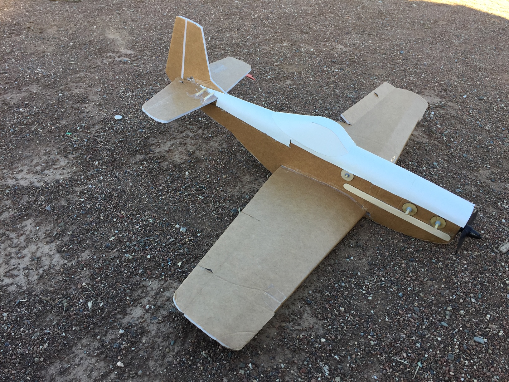

# FT Mini Mustang

July 2017

## Specifications

Weight Without Battery: 5.5 oz

Wingspan: 24.5 Inches (622mm)

Center of Gravity: 1 Inch (25mm) from leading edge of wing (Recommended)

Control Surface Throws: 12 Degrees

Expo Suggestions: 30%

Recommended Motor: 2204-2206 Size; 2200kV minimum

Recommended Propellers: 6x4.5

Recommended ESC: 20 Amp

Recommended Battery: 3S 11.1V LiPo 800mAh

Recommended Servos: ~5 Gram Micro Servos

## Plans

[FT Mini Mustang Plans](../../assets/rc-airplanes/p51/plans.pdf)
