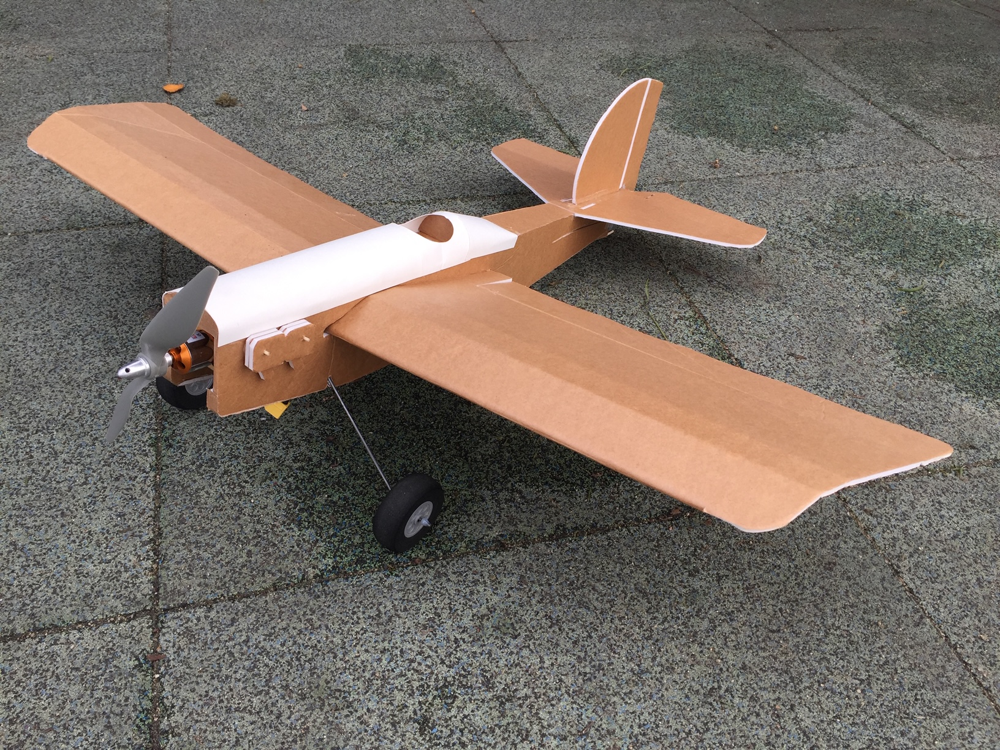

import ReactPlayer from 'react-player'

# FT Simple Scout

July 2018

## Video

    <ReactPlayer className="video_player" controls height="100%" width="100%" url="https://www.youtube.com/watch?v=GHQCRJQBI8o"/>

## Specifications

Weight Without Battery: 15 Oz

Wingspan: 37.5 Inches (952mm)

Center of Gravity: 2.25 Inches (355mm) from the leading edge of wing (Recommended)

Control Surface Throws: 12 Degree

Expo Suggestions: 30%

Recommended Motor: Park 400 Type, 810kV minimum

Recommended Propellers: 10x4.7

Recommended ESC: 18-30 Amp

Recommended Battery: 3S 11.1V LiPo 1800-2200mAh

Recommended Servos: ~9 Gram Micro Servos

## Plans

[FT Simple Scout Plans](../../assets/rc-airplanes/scout/plans.pdf)
