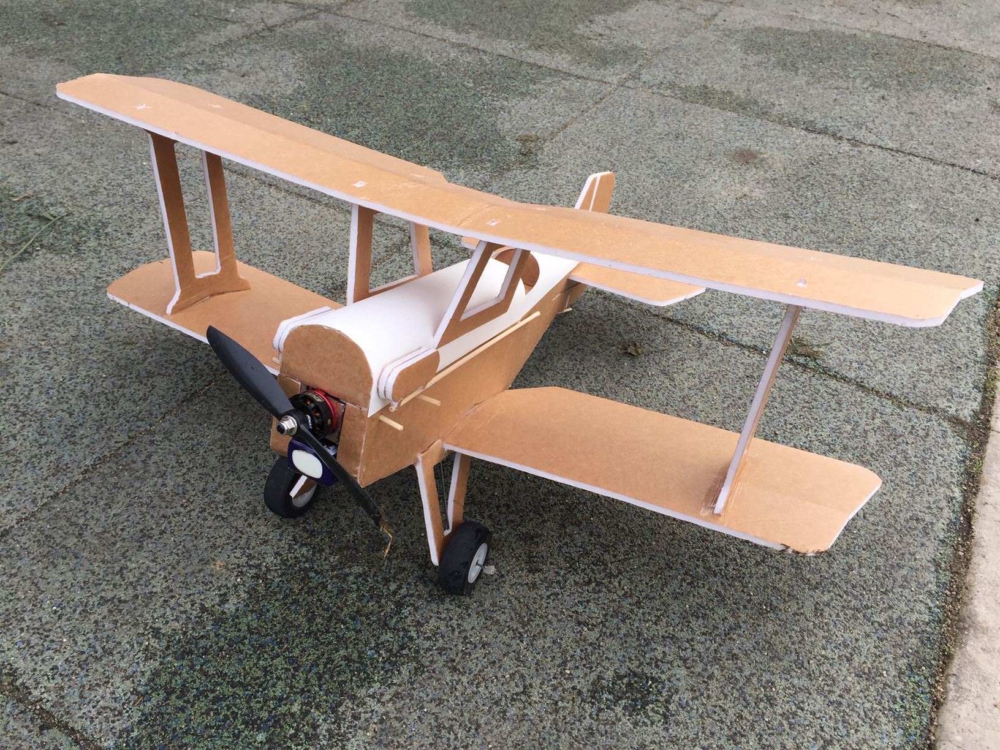

import ReactPlayer from 'react-player'

# FT Mini SE5

December 2018

## Video

    <ReactPlayer className="video_player" controls height="100%" width="100%" url="https://www.youtube.com/watch?v=7rs0aV4w3zU"/>

## Specifications

Weight Without Battery: 9 Oz

Wingspan: 24 Inches (609mm)

Center of Gravity: Directly on the fold of the top wing

Control Surface Throws: 12 Degrees

Expo Suggestions: 30%

Recommended  Motor: 2204-2205 Size; 2300kV Minimum

Recommended Propellers: 6x4.5

Recommended ESC: 20-30 Amp

Recommended Battery: 3S 11.1V LiPo 800mAh

Recommended Servos: ~5 Gram Micro Servos

## Plans

[FT Mini SE5 Plans](../../assets/rc-airplanes/se-5/plans.pdf)
