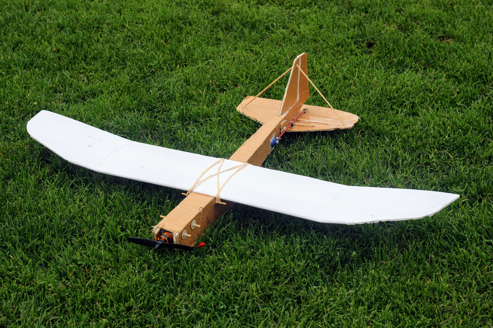

import ReactPlayer from 'react-player'

# FT Tiny Trainer

May 2017

## Video

    <ReactPlayer className="video_player" controls height="100%" width="100%" url="https://www.youtube.com/watch?v=4kowm-iJe28"/>

## Specifications

Weight Without Battery: 6.8 Oz 

Wingspan: 37 Inches (940mm)

Center of Gravity: 1.5-1.75 Inches (38-44mm) from leading edge of wing (Recommended)

Control Surface Throws: 16 Degrees

Expo Suggestions: 30%

Recommended Motor: Park 250 2200kV minimum

Recommended Propellers: 6x3

Recommended ESC: 12-20 Amp

Recommended Battery: 2S-3S 7.4V-11.1V LiPo 500-800mAh

Recommended Servos: ~5 Gram Micro Servos

## Plans

[FT Tiny Trainer Plans](../../assets/rc-airplanes/trainer/plans.pdf)
