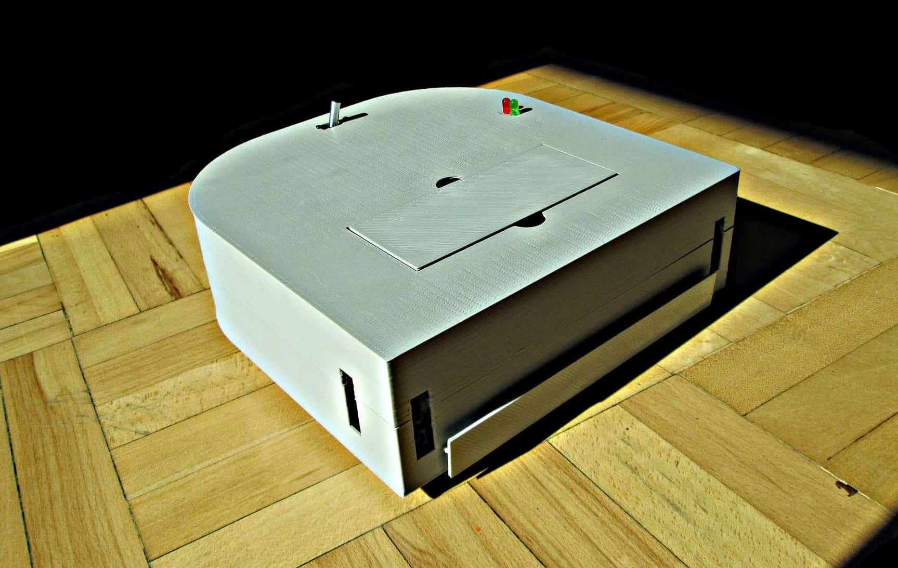
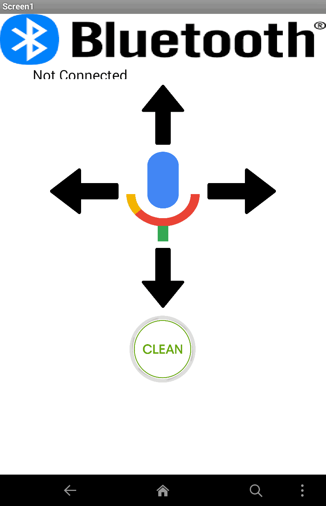
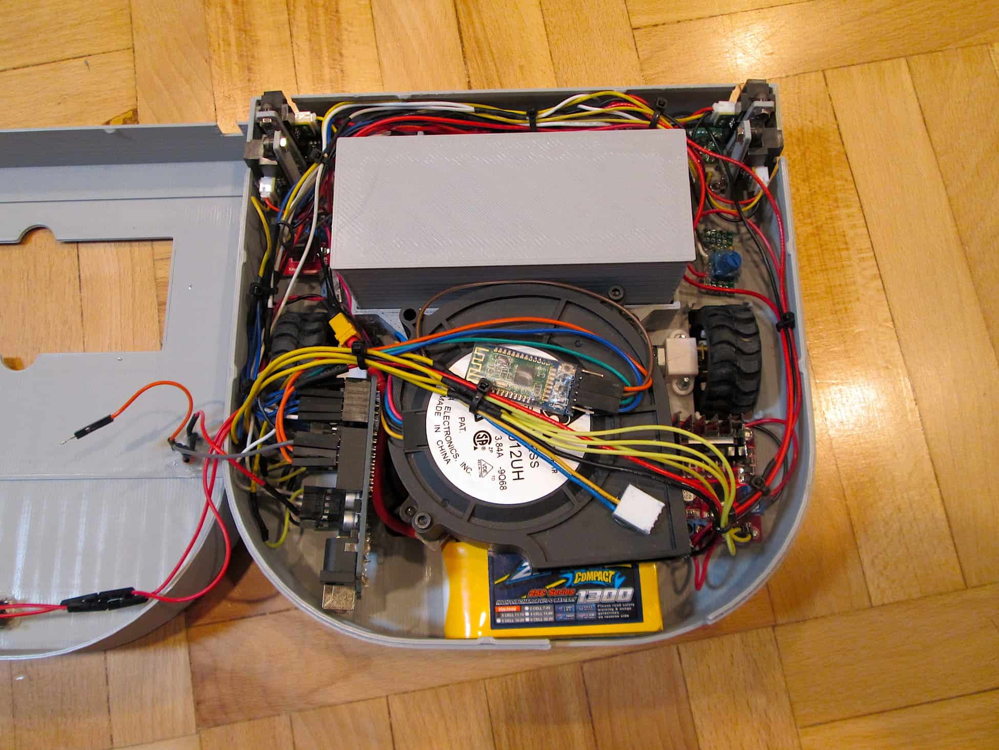
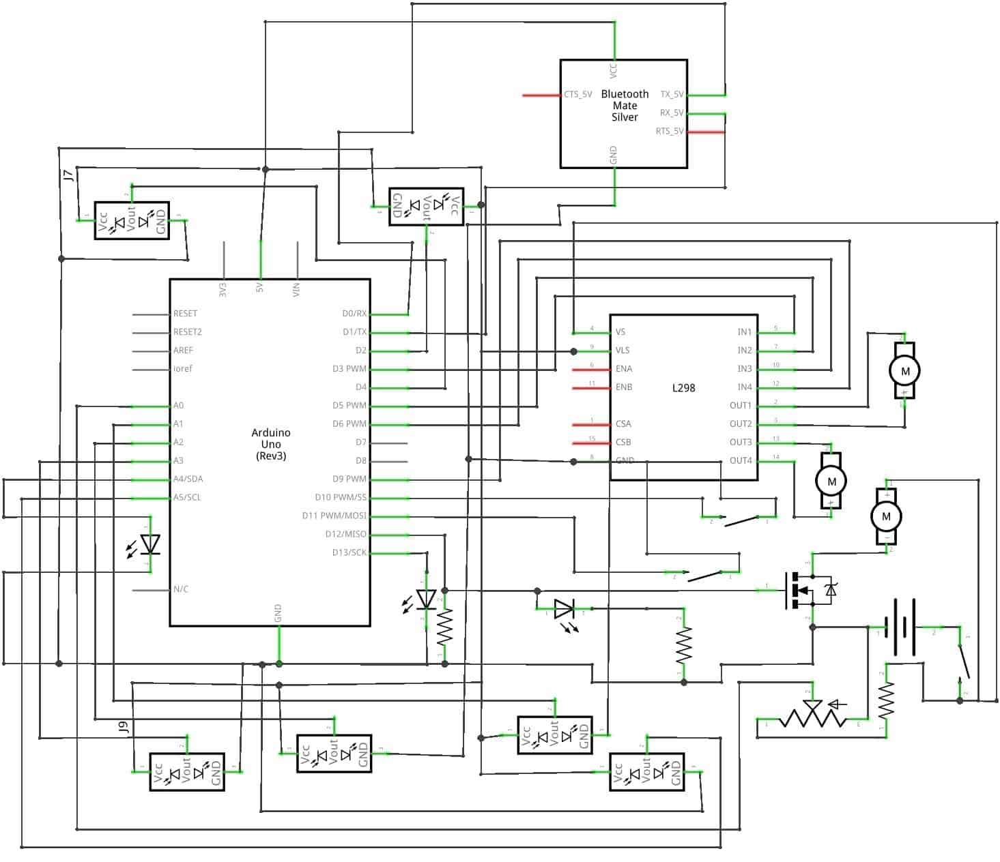
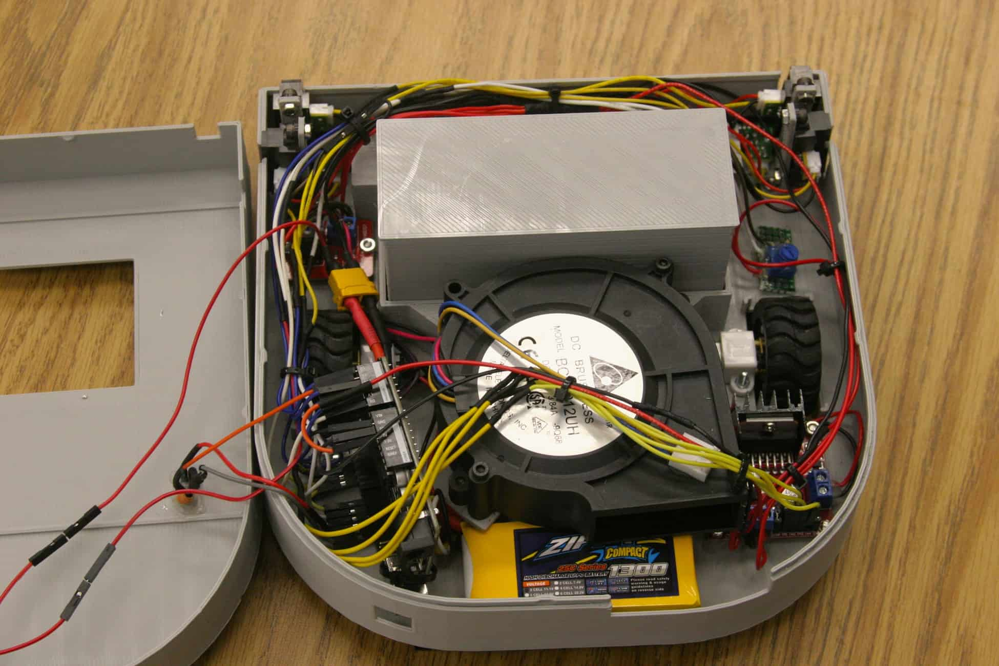
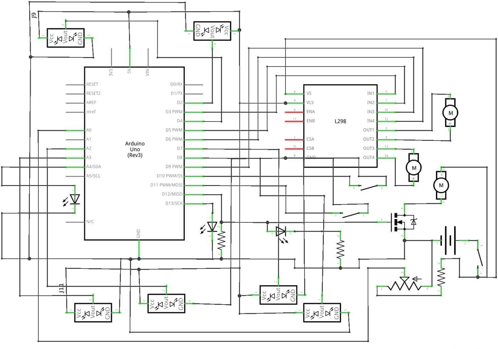
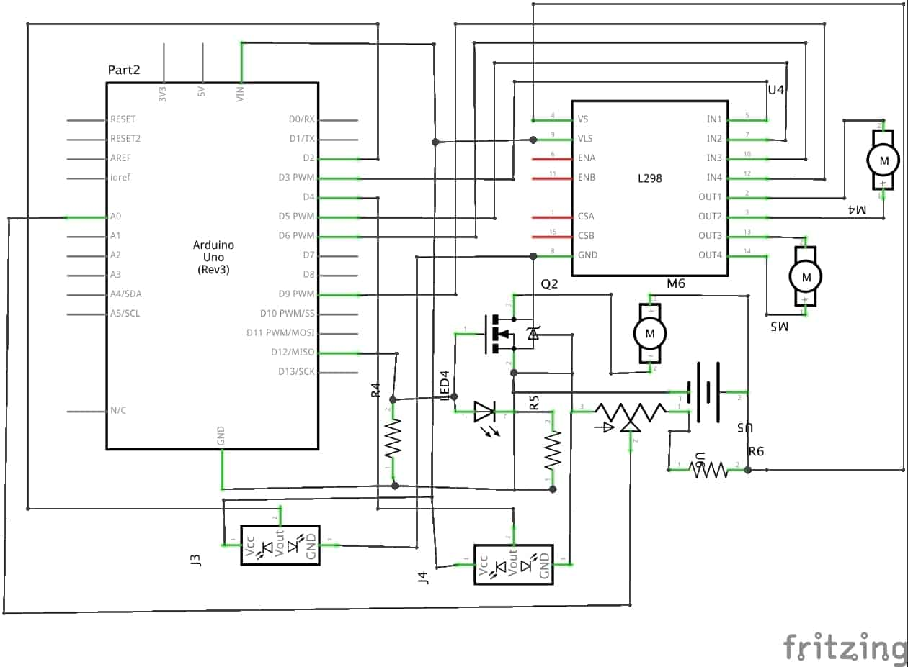
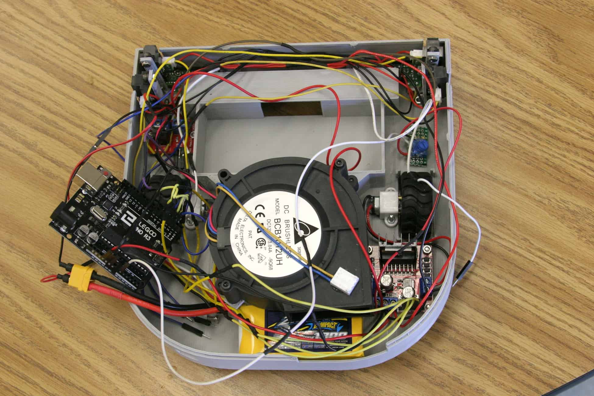
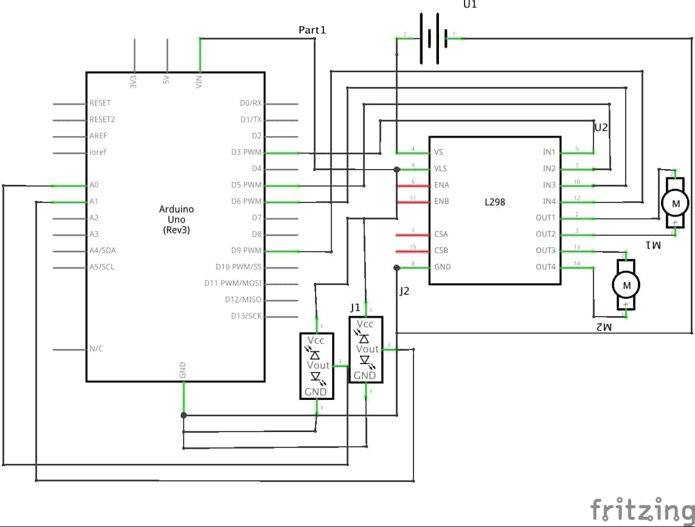
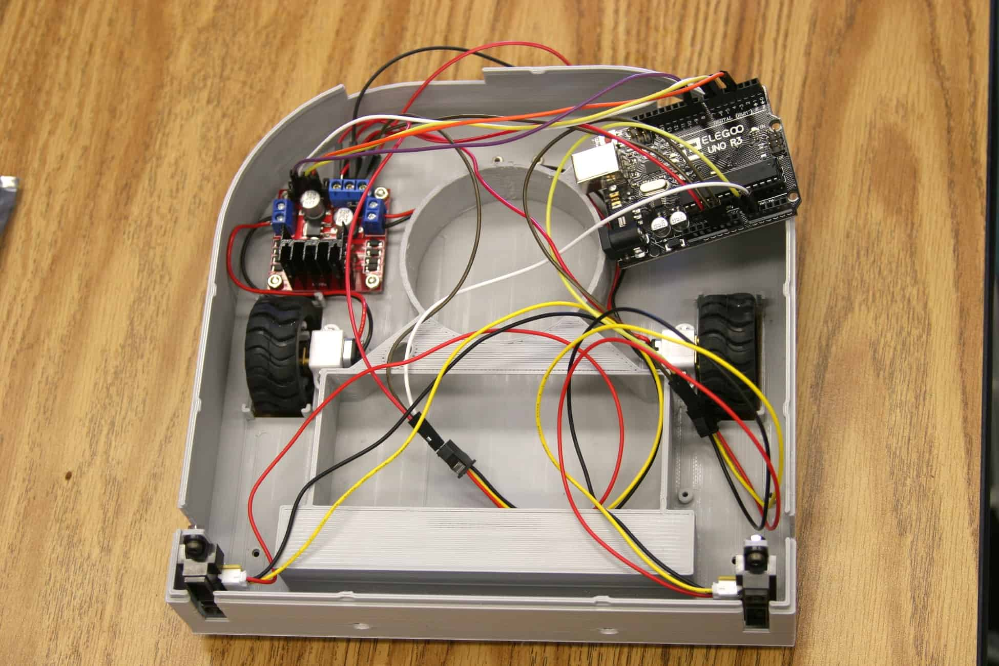

import ReactPlayer from 'react-player'

# Autonomous Vacuum Robot

June 2017 - July 2017

**[GitHub Repository](https://github.com/bandofpv/Vacuum_Robot)**

## Introduction

I have built a vacuum robot. This is a fun DIY project to work on during the summer. It’s an autonomous robot that will avoid walls and drop-offs. The robot will also help you understand how the arduino works. This is a super useful robot if you don’t like vacuuming the floor. Just lay it down and let it clean!

## Final Milestone

### Video

    <ReactPlayer className="video_player" controls height="100%" width="100%" url="https://www.youtube.com/watch?v=D1FHCfAPJcg"/>

### Documentation

I completed my final milestone for my vacuum robot. In the end, it vacuums the house for you! besides sucking up dirt and hair, it can avoid walls, stairs, and chairs. It has a 30 minute battery life and will let you know when the battery is low and needs a recharge. Some of the new features that were not shown in the video was the bluetooth capability. I added a little bluetooth module so I can wirelessly control the robot using my phone or computer. For the phone, I created a simple app that can move the robot forwards, right, left, and backwards. It also added a  voice recognition capability so you can tell it to clean and move around. Finally, there is the cleaning button where you can start and stop the robot from cleaning your house. To control it from your computer, you can just use the arrow keys and press “c” on the keyboard to start cleaning! One challenge that I faced would be connecting the bluetooth to my phone or computer. I never used bluetooth low energy before and never created code for a bluetooth module. With a little research, I was able to get it up and running.

### Pictures

## Third Milestone

### Video

    <ReactPlayer className="video_player" controls height="100%" width="100%" url="https://www.youtube.com/watch?v=ThmuH1fsDFk"/>

### Documentation

Today I finished my third milestone. I am finally done with my autonomous vacuum robot. I did some small modifications to the hardware, such as some new status lights and a switch. The new status lights allow the user to know what the robot is doing. For example if the LED (Light Emitting Diode) is blinking when you turn it on, then you will know that the robot will need to calibrate for 5 seconds. The IR (Infrared) sensors need time to get a clear reading when powering it up. Then, the light will stay on letting you know that the battery is full and will start vacuuming the house. If the battery dies, then the LED will start blinking again as the buzzer goes off. My switch is just a normal switch to open and close the circuit, turning the robot on and off. I also added and programed the bumper. The bumper consists of two push buttons so if either button gets hit, then it will move away. I finally added a battery alarm, so if the voltage divider doesn’t work, then the buzzer will also let you know that the battery is dead. I finally made changes to the code. I made my own function for the ground sensors and the LEDs. I made a function allowing me to blink an LED and change the brightness using PWM (Pulse Width Modulation). I used two for loops in the function that will keep looping until the time is over. So for one second it will turn on, and the other second it will turn off. For the ground sensors, I made a function that will take readings from the ground sensors. And if the sensors detect a cliff, then it will turn back. Because the ground sensors are so close to the ground and is so sensitive that it won’t get an accurate reading.  My new function will take one reading from the IR sensor, then will wait for 50 milliseconds, and will repeat that process until it gets a total of 4 readings. Then my function will return either ground or cliff using bitwise OR. So if one of the readings is a 1(ground) then the whole function will return ground. It will only return cliff if all of the readings are a 0(cliff). That is all the modifications I made to vacuum robot. I had so much trouble creating the function for the ground sensors and was very frustrated because I had figure it out before my parent night presentation. I also had trouble fitting all the parts in the robot because the chassis is small.

### Pictures

## Second Milestone

### Video

    <ReactPlayer className="video_player" controls height="100%" width="100%" url="https://www.youtube.com/watch?v=CJ6rm8M8DqI"/>

### Documentation

Today I accomplished my second milestone. I added a couple of new electronics to my vacuum robot such as 4 more IR (Infrared) sensors, a bumper, a fan, and a voltage divider. My milestone was more focused on the fan and voltage divider(a circuit that will let me safely measure the voltage from the battery using the arduino). I still need to program the wall, ground, and bumper sensors for my third milestone. The fan will be used for sucking in the dirt and dust on the floor. It’s connected into a digital pin(a pin on the arduino inputing or outputting 0 volts and 5 volts) so I can turn it on and off. I also added a removable container to hold in the dirt it sucks. The container also has a filter, similar to the ones in vacuum bags. All the dirt and dust will be caught by the filter and the air will escape through the back. The main purpose of the voltage divider is to decrease the voltage coming into the arduino. Because my Lithium Polymer battery(LiPo) will provide up to 12.6 volts, it will damage the arduino due to the large amount of voltage. The decreased voltage will go into one an analog pin. The arduino will then read the voltage coming from voltage divider and then calculate the real voltage coming from the battery using a formula. I also have a conditional statement turning the fan motor on if the battery is full and turn it off if the battery is low. It’s important to measure the voltage of the battery so you don’t damage it. If the cell voltage of any LiPo (Lithium Polymer) battery goes below 3 volts, then it will be destroyed. This is called over discharging. When you over discharge a battery, it will start to puff like a balloon and when it pops, it becomes a huge fire ball of flames and smoke. Obviously, I don’t want this to happen to my battery so that’s why I made a voltage divider consisting of a 1k resistor(component that resists electric current) and a 2k potentiometer(component that allows me to increase and decrease the resistance of electric current). The potentiometer allows me to calibrate the voltage divider so the arduino gets an accurate reading. To do this, you simply calculate the actual voltage of your battery using a voltmeter. Then write a simple code so you can see the amount of voltage coming from the arduino using the serial monitor. I also had a huge amount of trouble with the IR sensors. After hooking up all the sensors to the arduino, I realized that I ran out of analog pins(pin that inputs and outputs varying data). I only have 6 analog pins and have 6 IR sensors and a voltage divider. So after a couple of hours on the internet I came up with a great idea! I could use the front IR sensors in the digital pins. The problem with using digital pins is that the only values you get from the arduino is HIGH (5 volts) or LOW (0 volts), the IR sensor either detects something or doesn’t. The main reason I used the analog pins for the sensors is because they are distance sensors. You can measure the distance from the sensor and the wall, this is an analog signal. But because the front sensors don’t need to calculate the distance like the wall and ground sensors so it would work perfectly. This would free up 2 more analog pins used for the voltage divider. I had trouble programming it because conditional statements are different due to using the arduino pins. Here is my new code for the vacuum. I added the ability to control the fan motor, measure the voltage of my battery, and avoid obstacles using the IR sensors connected to the digital pins.

### Pictures

## First Milestone

### Video

    <ReactPlayer className="video_player" controls height="100%" width="100%" url="https://www.youtube.com/watch?v=h9BQUSkQpjo"/>

### Documentation

Today I completed my first milestone which was to build and program my IR sensors and motors. I connected the l298 dual H-bridge motor driver(part that lets you to change the speed and direction of motors) to the arduino(a programable microcontroller), the 2 motors, battery and the 2 IR sensors. The 1300mAh 3s Lithium Polymer(LiPo) battery will be used to power all the electronics. At full charge, the battery will provide up to 12.6 volts into the motor driver. The 12.6 volts will be used to power up the two metal gear motors. The power from the LiPo battery will also go into a 5 volt step down voltage regulator that will decrease the voltage down to 5 volts. The 5 volts will be used for powering up the two IR(infrared) sensors and the arduino. Then there is the ground that will be connected to all the electronics so the electricity will go through all the components. Now let’s look into the pins on the arduino. Analog pin 0 and 1 will be connected into the two IR sensors. I am also using PWM(Pulse Width Modulation) pins 3, 5, 6, and 9 for the motors. I am using PWM so I can  controll the speed of the motors. The H-bridge has 2 inputs for each motor. This allows you to change the direction of the motor. If you’re confused, you can check out the schematic below. So how does the arduino know what it needs to do? It’s in the code (link). When both sensors detect an object, then the robot will move backwards then turn left. When only the right sensor detects an object the robot will move backwards then turn right. When only the left sensor detects an object the robot will turn right. When both sensors don’t detect an object then the robot will move forwards. This code will help my robot avoid walls and other obstacles. But had some trouble with coding the arduino. Once I finished coding, I found out that my robot wasn’t moving in the correct direction. I thought it was my sensors that wasn’t working. In end, it was the code. I had to debug it for hours to later find out that my motors were traveling the opposite direction then what I expected. When the robot was supposed to go right, it went forwards. So after fixing the motor directions, it worked!

### Pictures

## Components List

|Qty|Component|
|:---|:---|
|x1|[Ball Caster](https://www.pololu.com/product/955)|
|x1|[Arduino Uno](https://www.digikey.com/product-detail/en/arduino/A000066/1050-1024-ND/2784006)|
|x2|[Motors](https://www.digikey.com/product-detail/en/sparkfun-electronics/ROB-12285/1568-1161-ND/5673747)|
|x1|[Motor Brackets](https://www.pololu.com/product/1086)|
|x1|[Wheels](https://www.digikey.com/product-detail/en/sparkfun-electronics/ROB-08899/ROB-08899-ND/5814304)
|x1|[Fan](http://www.ebay.com/itm/1pc-AVC-BA10033B12G-fan-9733-12V-4-5A-4pin-M3529-QL-/182281112508?_trksid=p2349526.m2548.l4275)|
|x6|[Sharp Distance Sensors](https://www.digikey.com/product-detail/en/sharp-microelectronics/GP2Y0A41SK0F/425-2819-ND/3884447)|
|x1|[1300mAh 3s 25c Lipo Battery](https://hobbyking.com/en_us/zippy-compact-1300mah-3s-25c-lipo-pack.html)|
|x1|[Driver Module](http://www.spikenzielabs.com/Catalog/index.php?main_page=product_info&products_id=1152)|
|x1|[Dual H-Bridge Motor Controller](http://www.robotshop.com/en/l298-dual-h-bridge-dc-motor-controller.html)|
|x1|[22 AWG Stranded Wire](https://www.sparkfun.com/products/11375)|
|x1|[22 AWG Solid Core Wire](https://www.sparkfun.com/products/11367)|
|x1|[Terminal Block](http://www.digikey.com/scripts/DkSearch/dksus.dll?Detail&itemSeq=227801092&uq=636301359863665827)|
|x1|[Heat Shrink](https://www.adafruit.com/product/344)|
|x1|[3.5 mm Bullet Connectors](https://hobbyking.com/en_us/3-5mm-3-wire-bullet-connector-for-motor-5pairs-bag.html)|
|x2|[Perfboard](http://www.allelectronics.com/item/pc-4/solderable-perf-board-3-x-4-1/4/1.html?gclid=CKWNnuX46NMCFYeUfgodT48CwA#)|
|x1|[Jumper Wires](https://www.amazon.com/Aketek-Jumper-Wires-Premium-Female/dp/B008MRZSH8)|
|x2|[Push Button](https://www.adafruit.com/product/1683)|
|x1|[Vacuum Bags](https://www.amazon.com/Hoover-WindTunnel-Style-CLOTH-Vacuum/dp/B009BTPI76)|
|x1|[Washers](http://www.homedepot.com/p/Crown-Bolt-3-16-in-Steel-Back-Up-Washer-10-Piece-41828/203624389)
|x1|[Nuts](http://www.homedepot.com/p/Everbilt-8-32-tpi-Zinc-Plated-Machine-Screw-Nut-100-Piece-800252/204273373)|
|x1|[Screws](http://www.homedepot.com/p/8-32-x-2-in-Zinc-Plated-Phillips-Slotted-Truss-Head-Combo-Drive-Machine-Screw-50-Piece-801002/204274432)|
|x1|[M3 Screws](https://www.amazon.com/iExcell-Total-100-Pack-Socket-Screws/dp/B01I74TTWU/ref=pd_bxgy_469_2?_encoding=UTF8&pd_rd_i=B01I74TTWU&pd_rd_r=B6ZVXTNNJWDA8GAQXNA7&pd_rd_w=SxHCL&pd_rd_wg=3X3fx&psc=1&refRID=B6ZVXTNNJWDA8GAQXNA7)|
|x1|[M3 Nuts](https://www.amazon.com/100Pcs-Female-Thread-Fastener-Silver/dp/B00GYS1SXU)
|x1|[Male to Male Jumper Wires](https://www.amazon.com/Breadboard-Jumper-Wire-75pcs-pack/dp/B0040DEI9M)|
|x1|[1k Ohm Resistors](https://www.amazon.com/Projects-25EP5141K00-Ohm-Resistors-Pack/dp/B0185FC5IG)|
|x1|[10k Ohm Potentiometer](https://www.sparkfun.com/products/9806)|

## 3D Parts

|Qty|Part|
|:---|:---|
|x1|[Tray](https://www.thingiverse.com/download:3639690)|
|x1|[Tray Lid](https://www.thingiverse.com/download:3639697)|
|x1|[Filter Holder](https://www.thingiverse.com/download:3639695)|
|x1|[Filter Tray](https://www.thingiverse.com/download:3639691)|
|x1|[Body Top](https://www.thingiverse.com/download:3832017)|
|x1|[Body Bottom](https://www.thingiverse.com/download:3832004)|
|x1|[Bumber](https://www.thingiverse.com/download:3639699)|
|x2|[Button](https://www.thingiverse.com/download:3639698)|
|x2|[Button Support](https://www.thingiverse.com/download:3639696)|
|x2|[Sensor Support](https://www.thingiverse.com/download:3832005)| 
