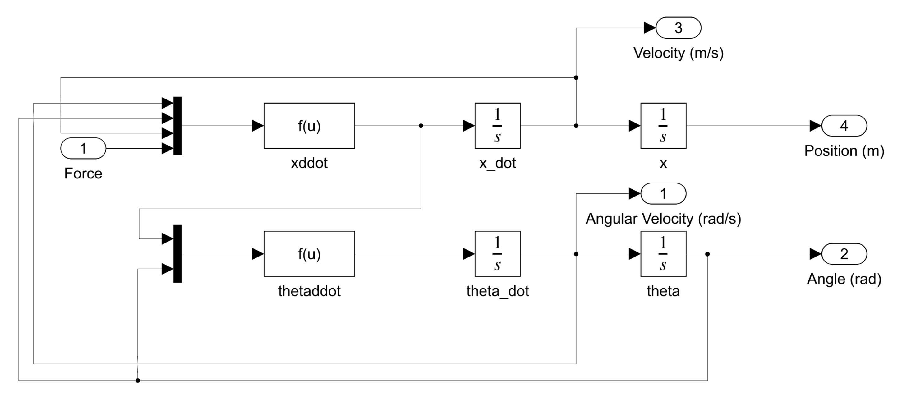
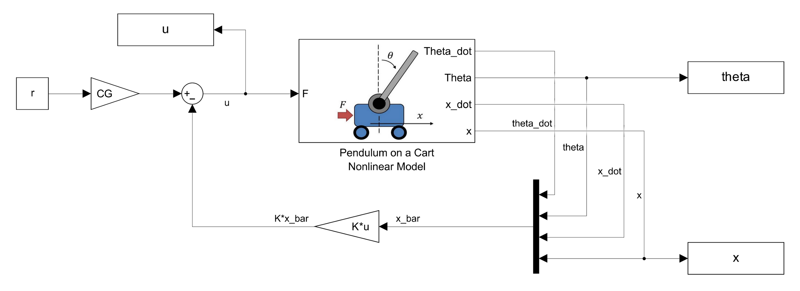

import ReactPlayer from 'react-player'

# Modeling and Simulation of a Inverted Pendulum

April 2025

**[GitHub Repository](https://github.com/bandofpv/USNA-Robotics-Courses/tree/main/EW306H/Labs/PendulumCart)**

## Introduction

My fifth major course at USNA was EW306H (Honors Advanced Control Engineering). We learned how to design state-space control systems and state estimators in both simulation and physical systems.

The final project for this course was to develop a simulation for a state variable feedback (SVF) controller of an inverted pendulum on a cart.

  

## Demo Video

    <ReactPlayer className="video_player" controls height="100%" width="100%" url="https://youtu.be/EIbfY-dxb-I"/>

## Design Documentation

The inverted pendulum is a classic control problem. The goal of the project was to design a state variable feedback (SVF) controller to stabilize the pendulum in the upright position. The system consists of a cart that can move left and right, and a pendulum that can swing up and down. The cart is controlled by applying a force to it, which affects both the position of the cart and the angle of the pendulum.

### Nonlinear Model

The first step in the design process was to derive the equations of motion for the system. Using Newton’s Laws of Motion one obtains two coupled, nonlinear, second-order ODEs:

$$
(M+m)\ddot{x} + ml\ddot{\theta}\cos(\theta) - ml\dot{\theta}^2\sin(\theta) = F
$$

$$
l\ddot{\theta} + \ddot{x}\cos(\theta) = g\sin(\theta)
$$

Where $x$ is the position of the cart, $\theta$ is the angle of the pendulum, $F$ is the force applied to the cart, $m$ is the mass of the pendulum, $M$ is the mass of the cart, $l$ is the length of the pendulum, and $g$ is the acceleration due to gravity. Solving these equations for $\ddot{x}$ and $\ddot{\theta}$ gives the more explicit state-space form:

$$
\ddot{x} = \frac{F + ml\dot{\theta}^2\sin(\theta) - mg\sin(\theta)\cos(\theta)}{M + m\sin^2(\theta)}
$$

$$
\ddot{\theta} = \frac{g\sin(\theta) - \ddot{x}\cos(\theta)}{l}
$$

The following nonlinear Simulink model can thus be formed: 

### Linear Model

The next step was to linearize the system about the equilibrium point. The equilibrium point is defined as the point where the pendulum is upright and the cart is at rest. This point is given by: $\bar{x}_0 = [0, 0, 0, 0]^T$.

The linear perturbation equation (LPE) is given by:

$$
\dot{\bar{x}} = A\bar{x} + Bu
$$

Where $\bar{x}$ is the state vector, $A$ is the system matrix, $B$ is the input matrix, and $u$ is the input force applied to the cart. The state vector is defined as:

$$
\bar{x} = \begin{bmatrix} \theta \\ \dot{\theta} \\ x \\ \dot{x}  \end{bmatrix}
$$

The system matrix $A$ and input matrix $B$ are given by:

$$
A = \begin{bmatrix} 0 & \frac{(M+m)g}{Ml} & 0 & 0 \\ 1 & 0 & 0 & 0 \\ 0 & -\frac{mg}{M} & 0 & 0 \\ 0 & 0 & 1 & 0 \end{bmatrix}
$$

$$
B = \begin{bmatrix} -\frac{1}{Ml} \\ 0 \\ \frac{1}{M} \\ 0 \end{bmatrix}
$$

The system matrix $A$ describes the dynamics of the system, while the input matrix $B$ describes how the input affects the system. 

The parameters used in the simulation are as follows:

| Parameter | Description | Value |
|:---:|:----:|:---:|
| $m$ | Mass of the pendulum | $0.125 \,\textrm{kg}$ |
| $M$ | Mass of the cart | $0.261 \,\textrm{kg}$ |
| $l$ | Length of the pendulum | $0.337 \,\textrm{m}$ |
| $g$ | Acceleration due to gravity | $9.81 \,\frac{\textrm{m}}{s^2}$ |

### Controller Requirements

The goal is to move the cart from its initial position at $x(t = 0) = 0 \,\textrm{m}$ to a reference destination $\textrm{ref} = 0.1 \,\textrm{m}$ and, at the same time, balance the pendulum about its upward position at $\theta = 0 \,\textrm{rad}$. Specifically,

1. The cart must be within $\pm2\%$ of its final position in two seconds
2. The cart must not overshoot its final position by more than $4.32\%$
3. The cart must travel to and settle at the reference destination $\textrm{ref} = 0.1 \,\textrm{m}$

### LPE Parameters

The controllability of the model $(A, B)$ can be tested by taking the controllability matrix of a 4x4 state-space model:

$$
[B, AB, A^2B, A^3B]
$$

The rank of the controllability matrix must be equal to the number of states in the system. The rank of the controllability matrix is 4, which means that the system is controllable.

The output of interest is the position of the cart, which is given by:

$$
C = \begin{bmatrix} 0 & 0 & 0 & 1 \end{bmatrix}
$$

### Original Transfer Function

The resulting original transfer function (ORTF) of the LPE is:

$$
G(s) = \frac{s\pm5.3953}{s^2(s\pm6.5613)}
$$

Where the resulting pole-zero map is:

  
  

The system has two poles at the origin and two conjugate poles at $s = \pm5.3953$. The system is unstable because the pole, $s=0.3953$, is on the right half-plane.

### Desired Characteristic Polynomial

Given a settling time, $T_s$, of 2 seconds and a percent overshoot, $\%OS$, of $4.32\%$, the following damping ratio and natural frequency can be calculated:

$$
\zeta = \frac{-\ln(\%OS/100)}{\sqrt{\pi^2 + \ln^2(\%OS/100)}} = 0.707
$$

$$
\omega_n = \frac{4}{T_s\zeta} = 2.8283
$$

The first two poles of the desired characteristic polynomial (DCP) can be calculated:

$$
p_{1,2} = -\zeta\omega_n \pm j\omega_n\sqrt{1-\zeta^2} = -2 \pm j2
$$

The third pole was selected at $5.3953$ to cancel out the zero, $s=-5.3953$, in the ORTF. However, the 2nd observed zero, $s=5.3953$, is positive and selecting a pole to the right of the origin would result in instability. Thus, the final pole was selected at the natural frequency, $\omega_n = 2.8283$, which strikes a balance between both low gains and an effective speed of response.

With the selected desired poles:

$$
p_{1,2} = -2 \pm j2
$$

$$
p_{3} = -2.8283
$$

$$
p_{4} = -5.3953
$$

The following DCP can be formed:

$$
\phi(s) = (s + 2 \pm j2)(s + 2.8283)(s + 5.3953)
$$

### SVF Gains and Calibration:

The SVF gains can be calculated using Ackermann's formula:

$$
K^T = \begin{bmatrix} 0 & 0 & 0 & 1 \end{bmatrix}C^{-1}\phi(A)
$$

Where $C$ is the controllability matrix and $\phi(A)$ is the desired characteristic polynomial evaluated at the system matrix $A$. The resulting gains are:

$$
K = \begin{bmatrix} -1.4584 & -9.0946 & -1.1371 & -1.0944 \end{bmatrix}
$$

The gains were then calibrated using the following equation:

$$
CG = \frac{1}{C(-A+BK)^{-1}B}
$$

Where $CG$ is the calibration gain. The resulting calibration gain is:

$$
CG = -1.0944
$$

This value guarantees that the reference input aligns with the calculated gains, ensuring proper input calibration for the linearized plant model.

### Block Diagram

Incorporating the SVF controller around the nonlinear dynamics model results in the following Simulink block diagram:

### Closed Loop Transfer Function

The resulting closed loop transfer function (CLTF) of the SVF controller and plant model is as follows:

$$
G_{CL}(s) = \frac{s \pm 5.3953}{(s + 2 \pm j2)(s + 2.8283)(s + 5.3953)}
$$

Where the resulting pole-zero map is:

  
  

The system now matches the desired characteristic polynomial and is stable.

### Simulation Results

The control design successfully meets all specified requirements as illustrated in plots below. The cart achieves the desired settling time of $2 \,\textrm{sec}$, maintains an overshoot of less than $4.32\%$, and settles accurately at the reference position of $0.1 \,\textrm{m}$.

Upon examining the transient response of the cart position, an unusual behavior is observed immediately after the start: the cart initially moves backward. This is likely due to the pendulum arm needing to lean forward first in order to maintain balance while enabling the cart to move forward. 

Regarding the control force, $u$, which is measured in newtons, the initial force reaches $-0.1094 \,\textrm{N}$. While this slightly exceeds the $\pm0.1 \,\textrm{N}$ bound, it is not considered to be significantly problematic for the system's operation.

Finally, the LPE remains valid throughout the simulation, as the angular position, $\theta$, of the pendulum stays close to the operating point of $0 \,\textrm{rad}$. The maximum deviation observed is only $0.017 \,\textrm{rad}$, confirming that the angular displacement remains small during the entire motion.

  
  

  
  

  
  

