import ReactPlayer from 'react-player'

# Ping Pong Ball Feedback Controller

February 2024 - April 2024

**[GitHub Repository](https://github.com/bandofpv/USNA-Robotics-Courses/tree/main/EW202/Labs/PI_Control)**

## Introduction

My second course in robotics and control engineering introduced control theory, instrumentation, and mechatronic concepts.

The final project for this course was to develop a Proportional and Integral Controller onto a [Raspberry Pi Pico](https://www.raspberrypi.com/products/raspberry-pi-pico/) microcontroller to manipulate a fan to levitate a ping pong ball at a user specified height.

  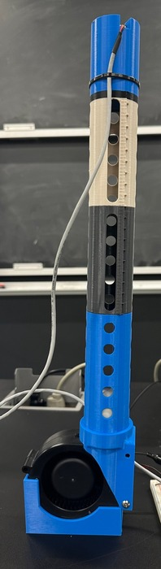

## Final Report

**Abstract** — The Feedback Control Laboratory’s objective is to create a control logic program using relay control, proportional (P) control, and proportional and integral (PI) control to levitate a ping pong ball at a desired height for any period of time. The laboratory builds knowledge of how to design a program in order to properly calibrate IR sensors and apply the Ziegler-Nichols’ method for tuning control systems. It specifically bolsters the understanding of the feedback control configuration by the requirement to design a program that affects each component and to analyze its data. The final design of the program resulted in successfully controlling motor power and levitating the ball at one height

### Introduction

**Problem Statement and Objectives**

&nbsp;&nbsp;&nbsp;&nbsp;The objective of this lab is to levitate a ping pong ball at a desired height using the 3D printed structure illustrated in Figure 1. As such, the following are the learning objectives of this lab: utilize serial communication between MATLAB and an RP2040 to transfer data and plot, use the RP2040 16-bit ADC to collect IR sensor output, construct a model that relates ADC voltage to distance, use PWM with a MOSFET to control the speed of a DC fan motor, and develop a control logic program that can accomplish the main objective of the lab.

  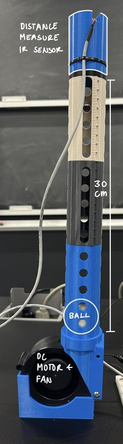
  
Figure 1

**Related Work**

&nbsp;&nbsp;&nbsp;&nbsp;Ziegler and Nichols advanced the methods of tuning parameters by introducing their Ziegler-Nichols tuning formula in 1942. Their tuning method aimed to minimize the rise time, maximum overshoot, and setting time for PID control.

&nbsp;&nbsp;&nbsp;&nbsp;The Traditional Ziegler-Nichols method sets the proportional gain at a very low number. Then, with multiple steps in experimentation, they increase the gain until the system oscillates to extract the parameters k (gain), L (delay time), and T (time constant). The Ziegler-Nichols formula is then applied to get controller parameters of proportional gain and period of oscillation [1]. The traditional method is aggressive which leads to high overshooting and an unstable system.  We attempted to emulate this method of tuning in the first part of our experiment. It resulted in a high peak overshoot and error.

&nbsp;&nbsp;&nbsp;&nbsp;The Ziegler-Nichols method was applied to a hot water dispenser. In the experiment, they tested the hot water temperature with and without the PID controller that used the Ziegler-Nichols method and compared both results. The results determined that without the PID controller, the temperature of the water was not able to maintain a stable temperature, reaching a high point of about 95 degrees and dropping to 87 degrees Celsius. When a PID controller was used, the temperature approached a stable 92 degrees, having a solid state relay [2]. We see the same results in the Ping Pong experiment. Without the PI Controller, the ping pong ball seemed to be unpredictable with the ball maintaining different heights and ultimately being unstable. Whereas with the PI controller, the ping pong ball levitates with a steady oscillation and low error.

### Design Process

**Objectives and Desired Functionality**

&nbsp;&nbsp;&nbsp;&nbsp;Design an algorithm using relay, P, and PI controllers to levitate a ping pong ball at any specified height. For P and PI controllers, use the Ziegler-Nichols gain tuning method to calculate the proportional and integral gain parameters. Apply the parameters to the initial relay system to reduce error of the ball levitation system.

&nbsp;&nbsp;&nbsp;&nbsp;We hope to achieve a settling time no longer than 3 seconds and a ± 1cm error for all three relay, P, and PI controllers.

**Design Constraints**

&nbsp;&nbsp;&nbsp;&nbsp;Outside of being constrained to using the 3D structure illustrated in Figure 1, there are some limitations to the control logic outlined in this lab. For instance, the relay control logic program is limited by its extreme simplicity. The only way to get the levitation height more accurate is by adjusting the base voltage and incremental voltages. If the incremental voltage is too low, the fan power might not increase or decrease enough to impact ball height. Furthermore, P control is limited based on the error calculation. This method changes the fan voltage to the amount of error observed. During steady state, the error in the system will reach a point where it remains constant. While it doesn’t change, the fan voltage would not change. As a result, the steady state is offset from the desired height. This offset can not be eliminated using solely the P controller and we must implement other techniques.

**Ethical Considerations**

&nbsp;&nbsp;&nbsp;&nbsp;The automatic control solution here is important because it improves the capability for machines to learn and adapt to their environment around them. Most technology today including HVAC systems, drones, and overall industry control uses the PID controllers. It is the most common because it is simple and could be used in a wide range of conditions.  There is no simpler way of automation. The PID controller can be applied to volumetric control, pressure control, and also temperature control. Without it, those functions wouldn’t be able to be automated in a simple and straightforward method. It fully supports the IEEE Code of Ethics with no dangers to “safety, health, and welfare of the public” [3]. The advantages of the PID control are that it could achieve many different desired conditions, prevent equipment damage, and improve performance of machines through behavior adjusting. Overall, the control system only provides benefits to a multitude of industries today.

### Final Design

**Overview**

&nbsp;&nbsp;&nbsp;&nbsp;The overall operation of the final control design is relatively simple. MATLAB gives a desired height to the Pico. The Pico then calculates a duty cycle for the PWM signal to the MOSFET. The MOSFET is then able to mimic a variable voltage source to the fan motor which in turn builds up pressure and levitates the ping pong ball. The IR distance measuring sensor then collects a height reading and sends a voltage to the Pico’s ADC. The Pico then receives this information and calculates a new duty cycle depending on the error between the desired and actual ball heights. Figure 2 illustrates the described feedback control system.

  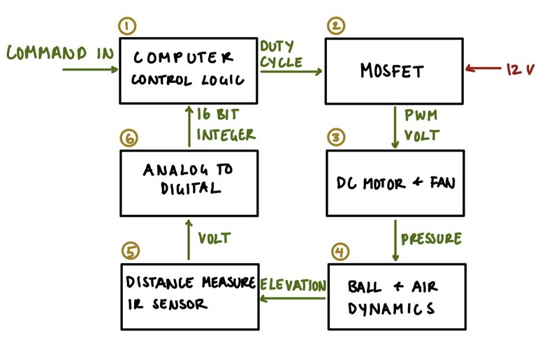
  
Figure 2

**Mechanical Subsystem**

&nbsp;&nbsp;&nbsp;&nbsp;The mechanical subsystem involves a 3D printed enclosure as illustrated in Figure 1. There is a fan at the bottom which blows air up through the plastic tube in order to levitate the ball. The lid at the top houses the IR Distance Sensor.

**Electrical Subsystem**

&nbsp;&nbsp;&nbsp;&nbsp;The final design utilizes the following components: DC fan, IR sensor, 12V power supply, MOSFET, and a RP2040. The connections of this circuit are illustrated in Figure 3.

  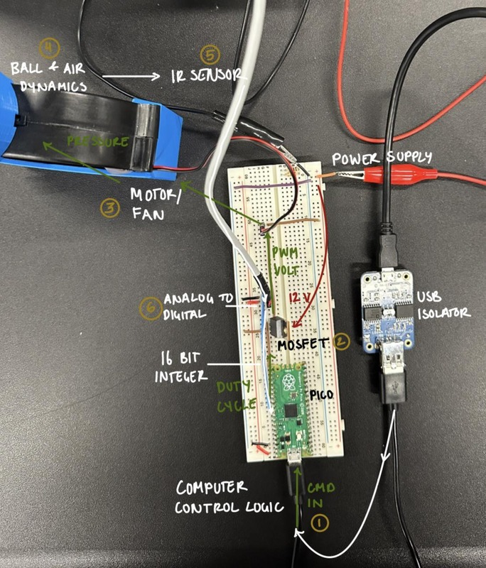
  
Figure 3

&nbsp;&nbsp;&nbsp;&nbsp;The calibration procedure of the IR sensor involved taking measurements at every hole of the tube. To increase accuracy, we took three measurements at each hole and took its mean. By using MATLAB’s polyfit command, we can form the following equation to model a polynomial relationship between the hole number (position) and the sensor reading:

$$
height = A * sensor^2 + B * sensor + C
$$

&nbsp;&nbsp;&nbsp;&nbsp;Figure 4 illustrates the inaccuracy of the IR sensor at close distances. However, it still proves that we can accurately model a polynomial relationship at further distances.

  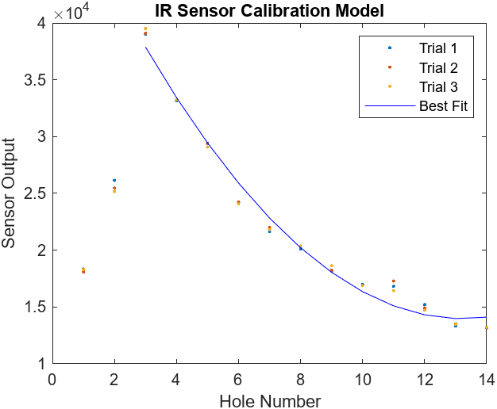
  
Figure 4

**Software Subsystem**

&nbsp;&nbsp;&nbsp;&nbsp;The final program involves close communication between MATLAB and the Pico as illustrated in Figure 5.1. The first step is for MATLAB to communicate to the Pico of the desired height to levitate the ping pong ball. MATLAB then sends the number of samples of sensor data for the Pico to collect every 0.02 seconds. Once those two pieces of information are collected, the Pico calculates a baseline voltage depending on the control algorithm used.

  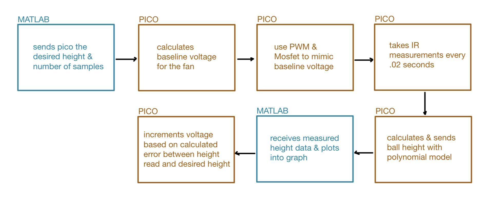
  
Figure 5.1

&nbsp;&nbsp;&nbsp;&nbsp;For relay control and proportional control with scheduled baseline voltage, the baseline voltage was calculated using a linear relationship between fan voltage and ball height as illustrated in Figure 5.2. To develop this model, we just experimented with different fan voltages and recorded the observed ball height. For proportional and proportional & integral control, the baseline voltage was 6 volts or 50% duty cycle as instructed in the lab procedure.

  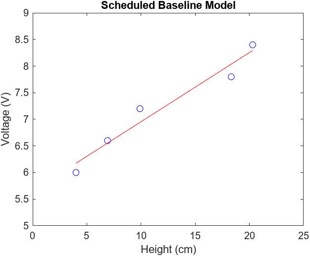
  
Figure 5.2

&nbsp;&nbsp;&nbsp;&nbsp;Once the baseline voltage is determined, the Pico will use PWM and a MOSFET to mimic the baseline voltage for the fan motor and begin taking IR measurements. After each sensor measurement, the Pico will calculate the height of the ball using the polynomial model in Figure 4. With these height measurements, the Pico can calculate the error between the actual height and the desired height.

&nbsp;&nbsp;&nbsp;&nbsp;Using relay control, the Pico will either increase or decrease the fan voltage by a constant amount to correct for error.  This constant voltage change is referred to as the incremental voltage. If the ball were to be below the desired height, the Pico would increase the fan voltage by adding the incremental voltage to its baseline voltage. If the ball were to be above the desired height, the Pico would decrease the fan voltage by subtracting the incremental voltage from the baseline voltage.

&nbsp;&nbsp;&nbsp;&nbsp;The same concept of adding or subtracting from the baseline voltage using the incremental voltage is used for both proportional (P) and proportional & integral (PI) control. However for proportional control, the incremental voltage is not constant and is proportional to the error. So a larger error will equate to a larger incremental voltage and vise-versa.  When integral control is used in conjunction with proportional control, it aims to correct the error between the steady state height and desired height. In other words, integral control aims to drive the integral of the error to zero. So any overshoot will result in the integral of error to be greater than zero, and to correct for this, the integral controller will drive the ball back down in an attempt to negate the integral of error back to zero.

**Feedback Control**

&nbsp;&nbsp;&nbsp;&nbsp;The transient response using relay control is illustrated in Figure 6.1 and the fan voltage response is illustrated in Figure 6.2. The only tuning required for relay control is to adjust the constant incremental voltage. This is done via trial and error ensuring that the incremental voltage is not too low where it is unable to reach the desired height or correct for error and it also can’t be too high where there will be excessively large fluctuations in height.

  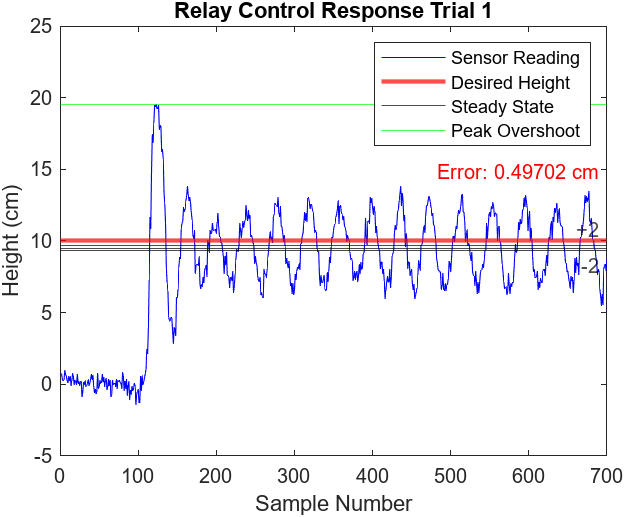
  
Figure 6.1

  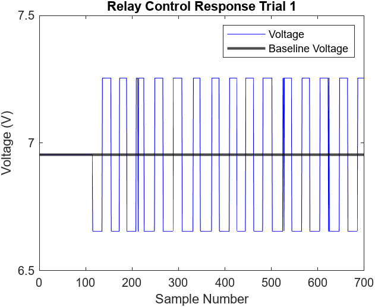
  
Figure 6.2

&nbsp;&nbsp;&nbsp;&nbsp;Tuning for proportional and proportional & integral control requires changing the gains. Using the Ziegler-Nichols method [1], we must start by setting the integral gain to zero and only change proportional gain. Starting with a small value, such as 0.01, we slowly increase the proportional gain to the critical value. This is observed when the steady state experiences excessive oscillations in the steady state as illustrated in Figures 6.3-4. We ended up with a critical gain value of 0.18. For proportional control, we set the p gain to half of the critical gain value using the Ziegler-Nichols method. The results of the P controller are illustrated in Figures 6.5-6.

  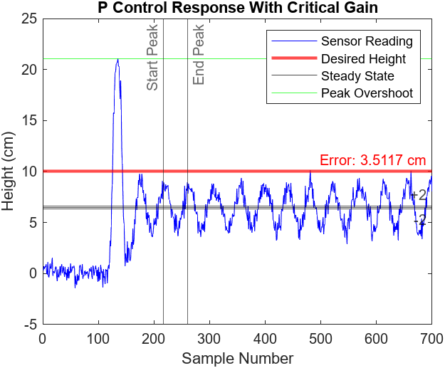
  
Figure 6.3

  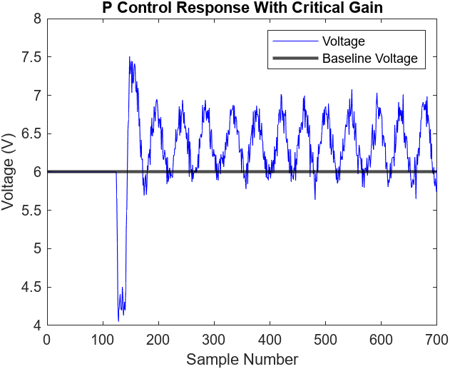
  
Figure 6.4

  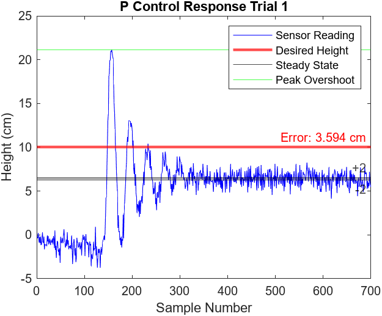
  
Figure 6.5

  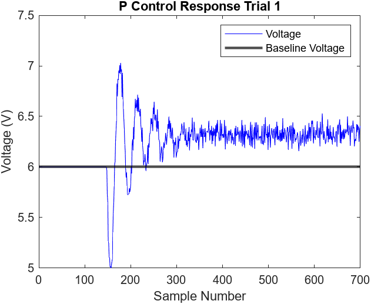
  
Figure 6.6

&nbsp;&nbsp;&nbsp;&nbsp;For proportional & integral control, we must determine the observed period of oscillation as illustrated in Figure 6.3. To do this, we just take the number of samples between two peaks during the steady state oscillation and multiply that by the sampling period of 0.02 seconds. According to the Ziegler-Nichols method for proportional & integral control, the proportional gain is 40% of the critical gain (0.072) and the integral gain is half of the critical gain divided by the period of oscillation (0.225). The results of the tuned PI controller are illustrated in Figures 6.7-8.

  
  
Figure 6.7

  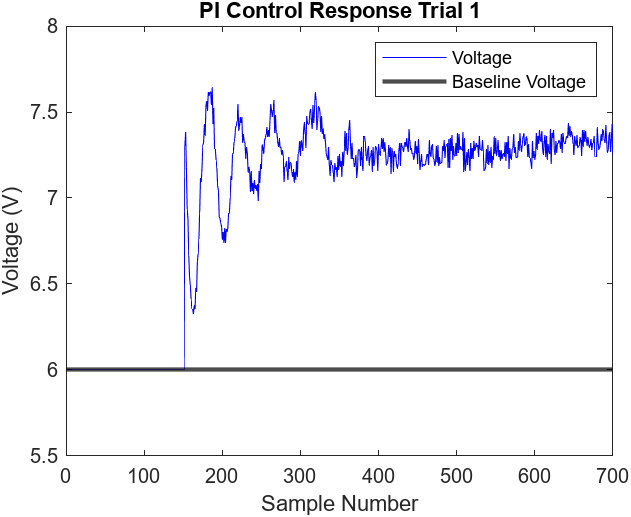
  
Figure 6.8

&nbsp;&nbsp;&nbsp;&nbsp;Due to the limitation of Proportional control systems, we incorporated a baseline voltage calculation to ensure that the control technique can reach a steady state closer to the desired height. Otherwise, the ball would consistently reach a steady state below the desired height as illustrated in Figure 6.5. By integrating the scheduled baseline voltage model with proportional control, the steady state was much closer to the desired height as illustrated in Figures 6.9-10

  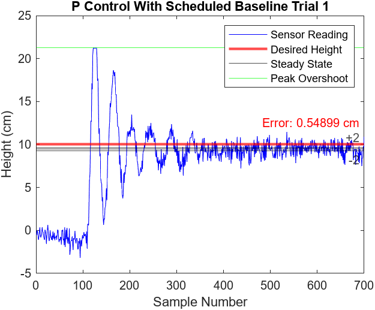
  
Figure 6.9

  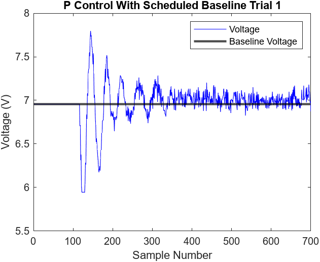
  
Figure 6.10

### Results and Analysis

&nbsp;&nbsp;&nbsp;&nbsp;The limitations of relay control is illustrated in Figures 6.1-2. Relay control can only change the voltage by a constant incremental voltage. As a result, the voltage graph contains square waves and the ball fluctuates within the desired height (approximately a 0.4 cm error). Unfortunately, the only way to reduce the oscillations is to decrease the incremental voltage. However, if the incremental voltage is too low, the fan might not be able to decrease or increase the fan voltage enough to meet the desired height.

&nbsp;&nbsp;&nbsp;&nbsp;The excessive oscillations observed by relay control can be corrected by implementing proportional control as illustrated in Figures 6.5-6. Proportional control aims to reduce the oscillations during the steady state by proportionally adjusting the fan voltage with respect to the calculated error. As a result, the steady state observed in Figure 6.5 has no visible oscillations. Unfortunately, the P controller is restricted to the amount of error observed. As long as the error is a constant value, so will the fan voltage. This results in a steady state below the desired height (approximately 3.5cm) as the baseline voltage of 6 volts is too low.

&nbsp;&nbsp;&nbsp;&nbsp;To correct for this steady state error, we can implement integral control with our pre-existing P controller. By incorporating integral control, the controller will aim to reduce the steady state error (the integral of the error) to zero. In actuality, Figure 6.7 displays a 0.06 cm error. Our design started the PI control as soon as the ball reached the desired height. As a result, our voltage graph, Figure 6.8, does not illustrate a typical “wind-up” that is characteristic of most PI controllers. The benefit of delaying the control logic is that the ball would be able to reach a steady state much quicker.  This is because the integral controller, when calculating the integral of error, won’t have to keep the ball above the desired height for an extended period in order to negate the long initial delay when the ball is not levitating.

&nbsp;&nbsp;&nbsp;&nbsp;Another way to correct for the proportional control steady state error is to use the schedule baseline voltage technique used in our relay control logic. That is, depending on the desired height, we can calculate a baseline voltage to reach that height. The results of this technique are illustrated in Figures 6.9-10. The performance is not as good using integral control because there is nothing in the control algorithm that is pushing the height error to zero in the steady state.  Instead, we are just using P control with a higher baseline voltage to push the ball high and reduce error. That baseline voltage relies heavily on the linear model in Figure 5.2. So any inaccuracy in the linear model results in an inaccuracy in the steady state. As such, there was an error of approximately 0.55 cm as illustrated in Figure 6.9.

&nbsp;&nbsp;&nbsp;&nbsp;We are reporting average performance. Figures 7.1-4 illustrate the performance of 2 more relay control trials. All three trials observed a peak overshoot at approximately 19 cm and reached steady state oscillations at around the 150th sample mark (3 seconds). The steady states of the trials all observed noticeable oscillations of about ± 3 cm and the error ranged from approximately 0.50 cm to 0.35 cm.

  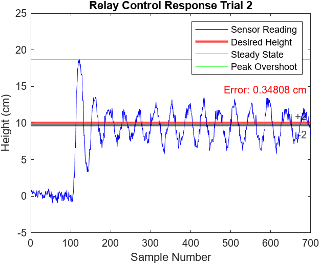
  
Figure 7.1

  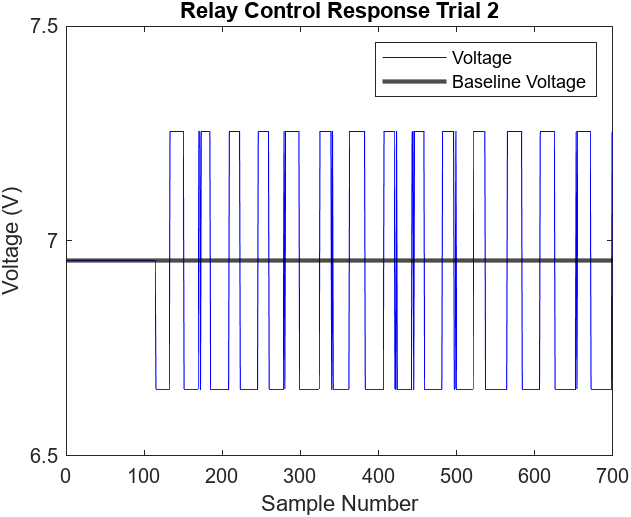
  
Figure 7.2

  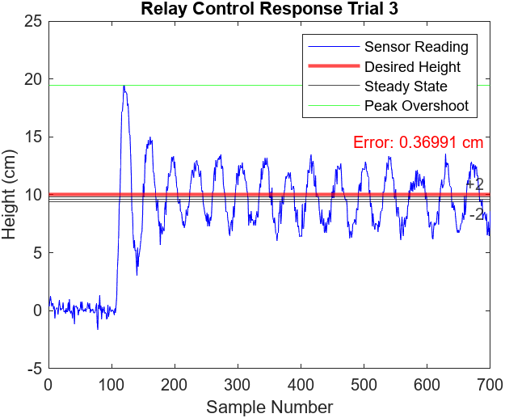
  
Figure 7.3

  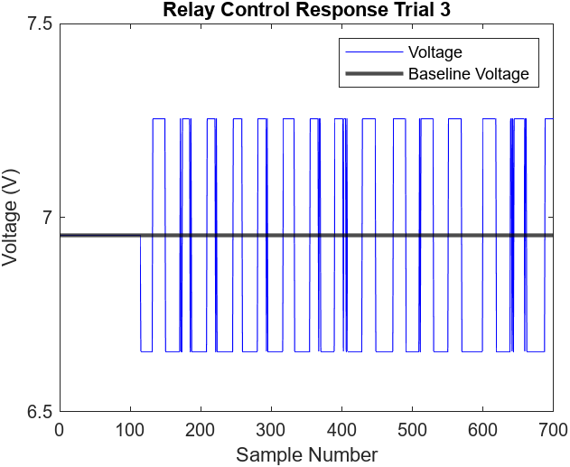
  
Figure 7.4

&nbsp;&nbsp;&nbsp;&nbsp;Figures 7.5-8 illustrate the performance of 2 more proportional control trials. All three trials observed a peak overshoot at approximately 21 cm and reached steady state at around the 250th sample mark (5 seconds). The steady states of the trials did not observe any noticeable oscillations and the error ranged from approximately 3.4 cm to 3.6 cm

  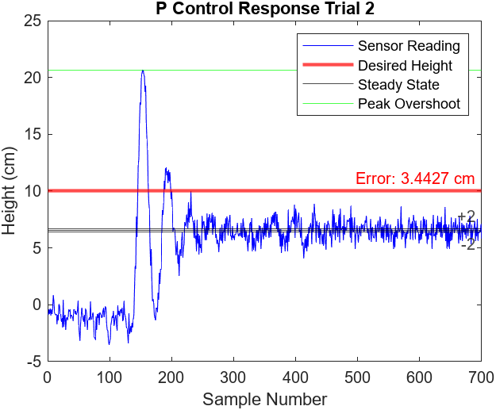
  
Figure 7.5

  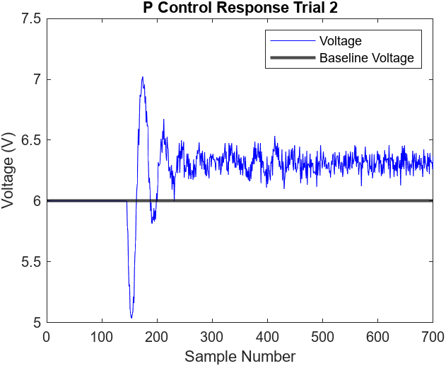
  
Figure 7.6

  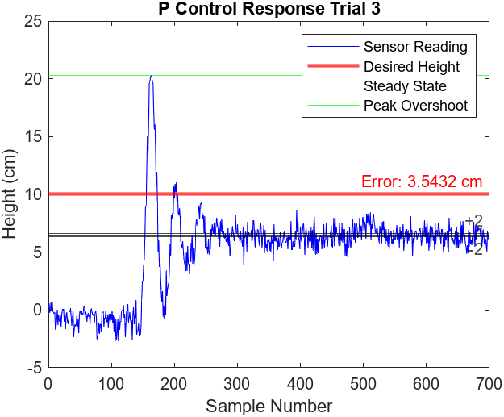
  
Figure 7.7

  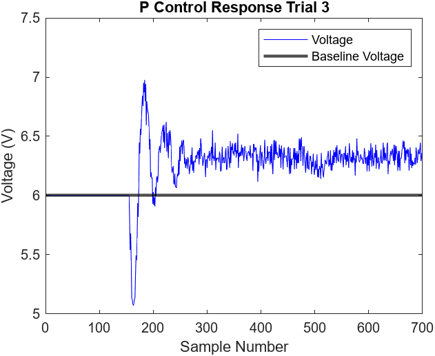
  
Figure 7.8

&nbsp;&nbsp;&nbsp;&nbsp;Figures 7.9-12 illustrate the performance of 2 more proportional and integral control trials. Figure 7.9 demonstrates an oddly low peak overshoot of 16 cm compared to the typical 20 cm. This abnormal behavior did not have any significant effect on the settling time. All three trials reached steady state at around the 350th sample mark (7 seconds), 100 samples (2 seconds) longer than the P controller. Additionally, the steady state of the trials did not observe any noticeable oscillations and the error was low, ranging from approximately 0.03 cm to 0.08 cm

  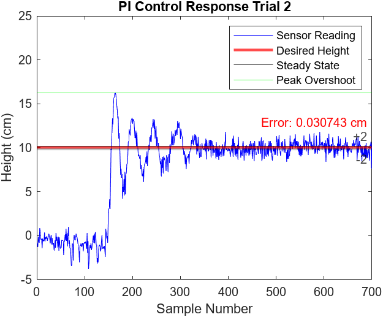
  
Figure 7.9

  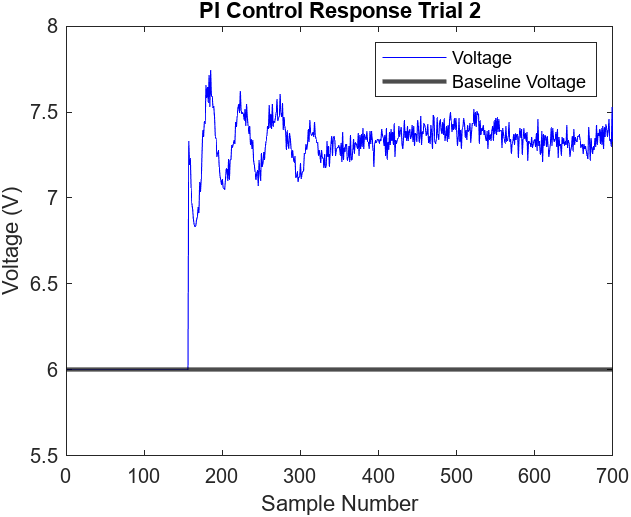
  
Figure 7.10

  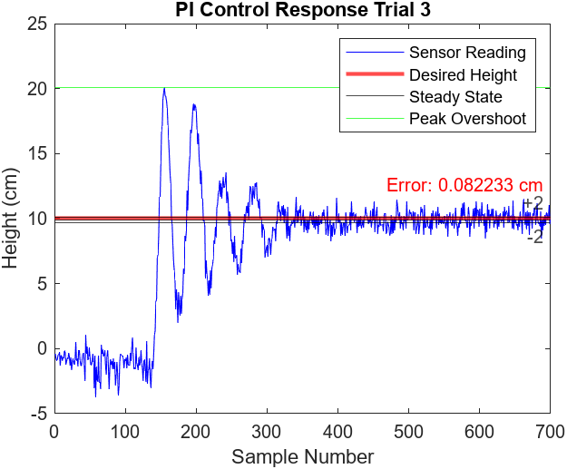
  
Figure 7.11

  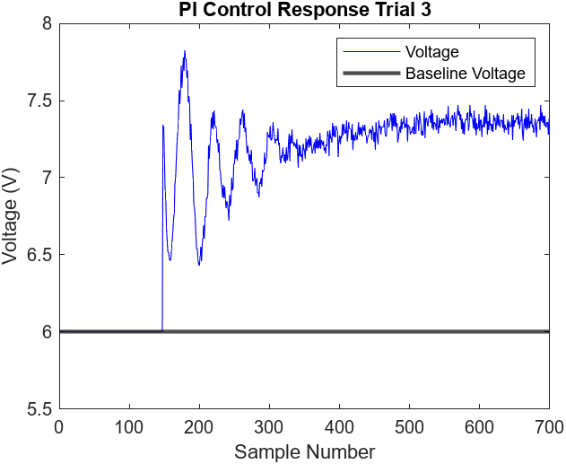
  
Figure 7.12

&nbsp;&nbsp;&nbsp;&nbsp;Figures 7.13-16 illustrate the performance of 2 more proportional control with scheduled baseline voltage trials. All three trials observed a peak overshoot at approximately 21 cm and reached steady state at around the 250th sample mark (5 seconds). The peak overshoot and settling times were consistent with the proportional control without scheduled baseline voltage trials. This makes sense as it is still using the same control logic but only adjusting the baseline voltage to reduce steady state error. Additionally, the steady states of the trials did not observe any noticeable oscillations and the error was slightly greater than the PI controller, ranging from approximately 0.23 cm to 0.55 cm

  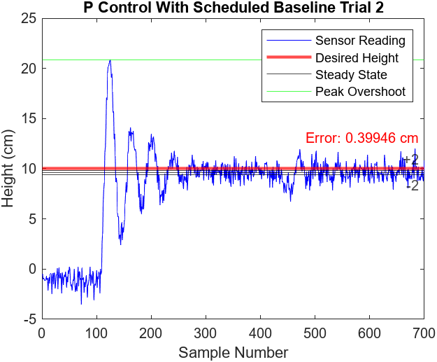
  
Figure 7.13

  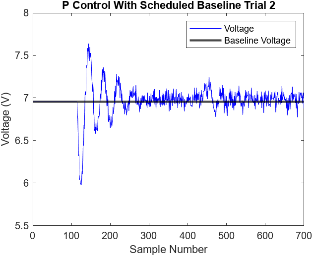
  
Figure 7.14

  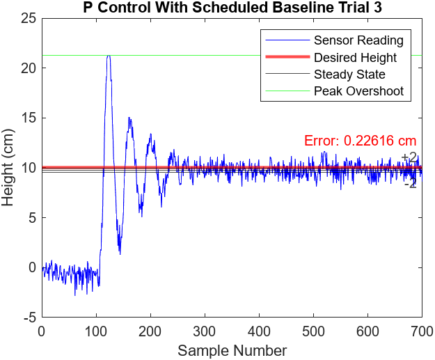
  
Figure 7.15

  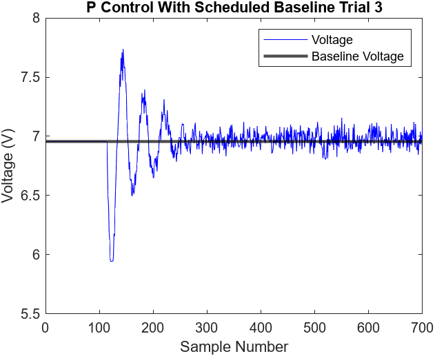
  
Figure 7.16

&nbsp;&nbsp;&nbsp;&nbsp;As observed in Figures 7.1-16, the control logic of all three techniques proved to be consistent. The overall trend throughout the control logic techniques is that as you decrease error, you observe increased settling times. Furthermore, the results observed in the graphs were predictable and expected given the design constraints

### Conclusion and Future Work

&nbsp;&nbsp;&nbsp;&nbsp;Our final program design for the relay, P, and PI controllers successfully allowed the IR sensor to read the distance, make calculations, and adjust power inputted to the dc motor and fan to keep the ball at a desired height. With the relay control logic program, the ball height was well maintained within a 3 cm fluctuation. To correct for this, we used the P and PI controllers which were both more effective in reducing the error and the magnitude of the fluctuations. The tuned PI controller was able to reach steady state at around the 350th sample mark (7 seconds) and resulted in low errors between 0.03 cm to 0.08 cm, a significant improvement compared to the relay controller.

&nbsp;&nbsp;&nbsp;&nbsp;Unfortunately, we still observed pretty long settling times often reaching past the 250th sample mark. To correct for this, we could use a more powerful and responsive fan motor. The motor in this experiment took an exaggerated amount of time to spool up the fan blades. As such, it took a while for the fan to build enough pressure to even levitate the ball. When the ball did levitate, it flew well past and dropped well below the desired height suggesting that the fan took time to adjust for error in ball height. This is most likely due to the limitation of the dc motor within the fan mechanism. The low torque motor formed a lag between the fan speed correction we desired and the actual output because it took a while for the motor to spin up the fan blades. So when we needed to increase the fan speed to correct for error, the fan took a while to reach the expected speed. As a result, the fan was always one step behind what the control algorithm wanted. As a result, it took a decent amount of time for the ball to stop fluctuating for both the P and PI controllers. If we used a high torque brushless motor, we could get more responsiveness and control over the fan speed.

&nbsp;&nbsp;&nbsp;&nbsp;To further improve upon our control logic, we can incorporate derivative control. By using derivative control as a part of our pre-existing PI controller, we can make fan voltage changes with respect to the derivative of the error. In other words, we will be better able to to adjust the fan voltage with the rate of error change. This will allow us to minimize the large fluctuations before settling and also decrease the time it takes to settle at its desired height. Unfortunately implementing this control is out of the scope of this lab and for a good reason. As seen in all the height vs. sample plots, the IR sensor outputs resulted in relatively noisy measurements. This would make tuning the derivative controller difficult as a noisy input signifies a large derivative or change. As such, we would probably have to incorporate some sort of filter for the height measurements before inputting it into a PID controller.

### References

[1] P. M. Meshram and R. G. Kanojiya, "Tuning of PID controller using Ziegler-Nichols method for speed control of DC motor," IEEE-International Conference On Advances In Engineering, Science And Management (ICAESM -2012), Nagapattinam, India, 2012, pp. 117-122.

[2] R. Aisuwarya and Y. Hidayati, "Implementation of Ziegler-Nichols PID Tuning Method on Stabilizing Temperature of Hot-water Dispenser," 2019 16th International Conference on Quality in Research (QIR): International Symposium on Electrical and Computer Engineering, Padang, Indonesia, 2019, pp. 1-5, doi: 10.1109/QIR.2019.8898259.

[3] IEEE Board of Directors, “IEEE Code of Ethics”, 2020.
