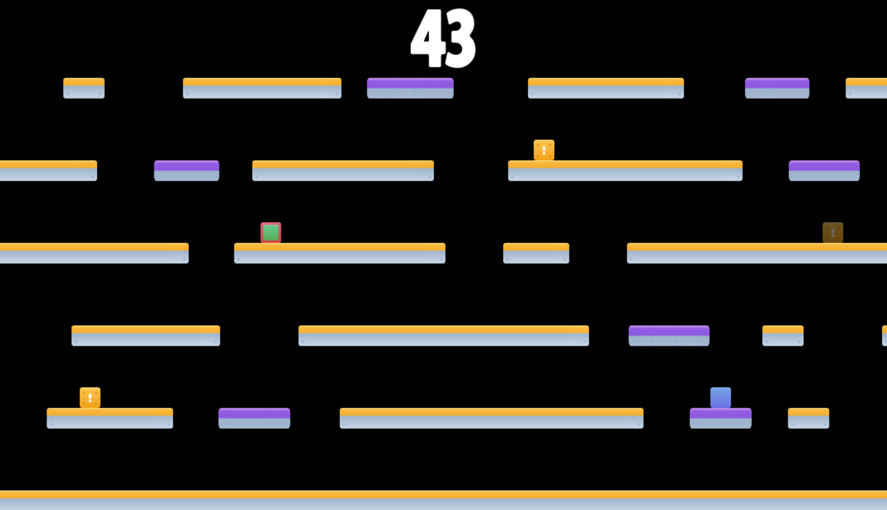

import ReactPlayer from 'react-player'

# Tag! Pygame

October 2023 - December 2023

**[GitHub Repository](https://github.com/bandofpv/EW200/tree/main/Labs/Tag)**

## Introduction

My first major course at USNA was EW200 (Intro to Programming and Design). We learned basic Python programming and 3D CAD design. 

The final project for this course was to create an original video game in Python using the [Pygame](https://www.pygame.org/news) library. I decided to make a multiplayer game of Tag! which includes a menu system, a basic physics engine, moving platforms, power ups, and more!

## Demo Video

    <ReactPlayer className="video_player" controls height="100%" width="100%" url="https://www.youtube.com/watch?v=5eZ-7K4gY0U"/>

## Description

This is a two player game with the objective of not being *it* before the time runs out!

### Select Difficulty

You can select between Novice and Pro game difficulties via the start menu. 
- The **Novice** difficulty involves only static platforms.
- The **Pro** difficulty involves static AND moving platforms.

### Movement

The *green* player controls with the WAD keys to move up, left, and right respectively. The *blue* player controls with the arrow keys.

### Game Mechanics

The player that is *it* is marked by with a red perimeter:

If you are *it* you will notice you have a **significant** speed and jump advantage over the runner. 

As such, the goal of the runner to collect powerups which spawn **randomly** throughout the map:

Powerups give speed and jump bonuses that even **trump** that of the *it* player!

Pro Tip: try jumping along the sides of platforms :blush:

