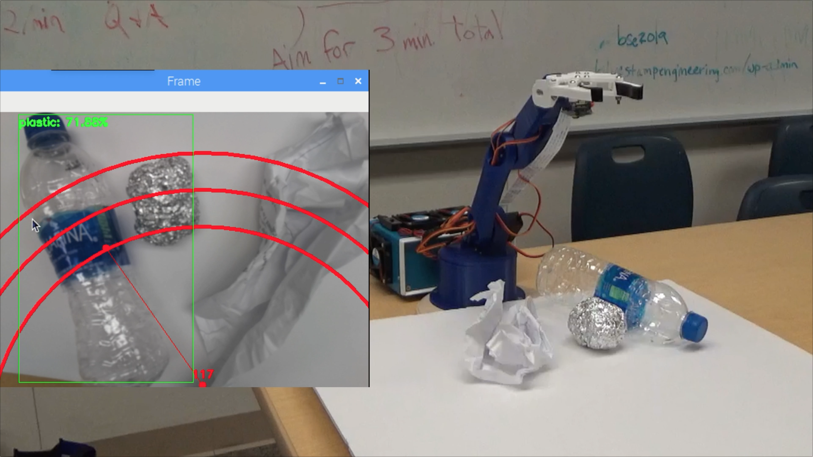

[GitHub Repository](https://github.com/bandofpv/Trash_Sorting_Robot)

## Introduction

Did you know that the average contamination rate in communities and businesses range up to 25%? That means one out of every four pieces of recycling you throw away doesn’t get recycled. This is caused due to human error in recycling centers. Traditionally, workers will sort through trash into different bins depending on the material. Humans are bound to make errors and end up not sorting the trash properly, leading to contamination. As pollution and climate change become even more significant in today’s society, recycling takes a huge part in protecting our planet. By using robots to sort through trash, contamination rates will decrease drastically, not to mention a lot cheaper and more sustainable. To solve this, I created a recycle sorting robot that uses machine learning to sort between different recycle materials. 

## Demo Video

## Demo Night Presentation

WIP!!!

## Final Milestone

VIDEO!!!

Today, I was able to complete my final milestone which was to mount all my components into a project box, enable the Edge TPU’s maximum frequency, and to make my robotic arm more accurate.

I decided to use an aluminum project box that was just big enough to fit my Arduino, Raspberry Pi, and my Coral Edge TPU USB Accelerator. Aluminum is great because it acts like a huge heat sink for my components. In order to mount all my hardware in my project box, I used brass standoffs to better help cool my components.

The two main parts that would get hot in my project would be my RPI and my TPU. These components are in charge of processing the object detection and thus are under a lot of computation load. Even when mounting my RPI outside of my case, It still gets hot. This is why I used a total of four fans to help use active cooling instead of passive cooling with my heat sinks. Now, I have passive and active cooling to help cool all my components. The four fans all run on 12 volts, so I had to get another power supply and solder all the fan wires into a bullet connector for my power supply. With the fans on, I noticed that my RPI barley got hot even after running object detection for a while. Usually, it gets hot and can cause burns, but with the fans, It was only a little warm. Below are pictures of my project box.

