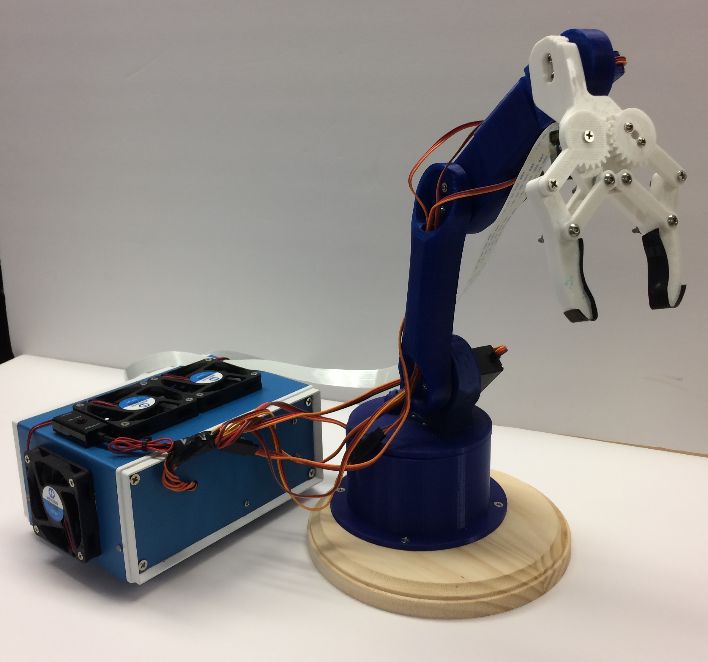
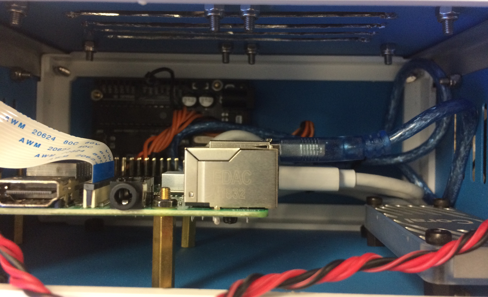
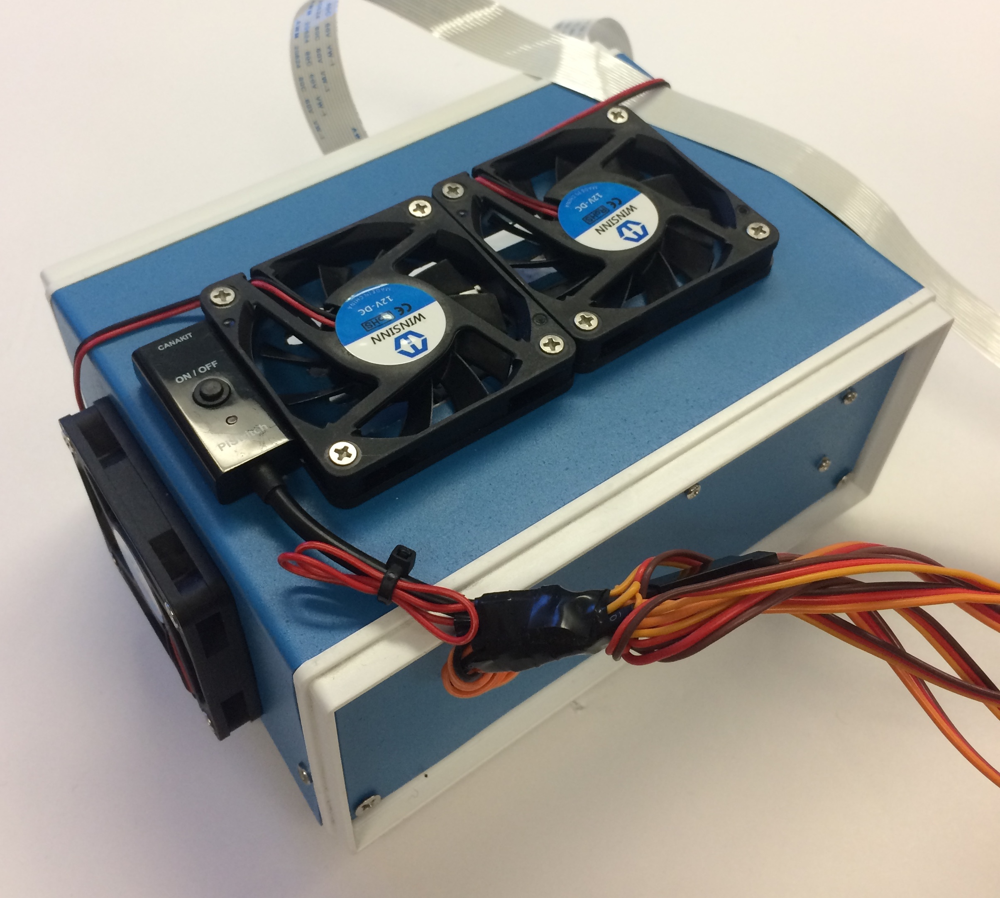
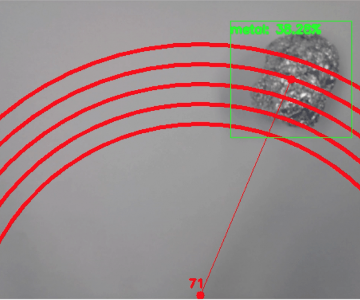
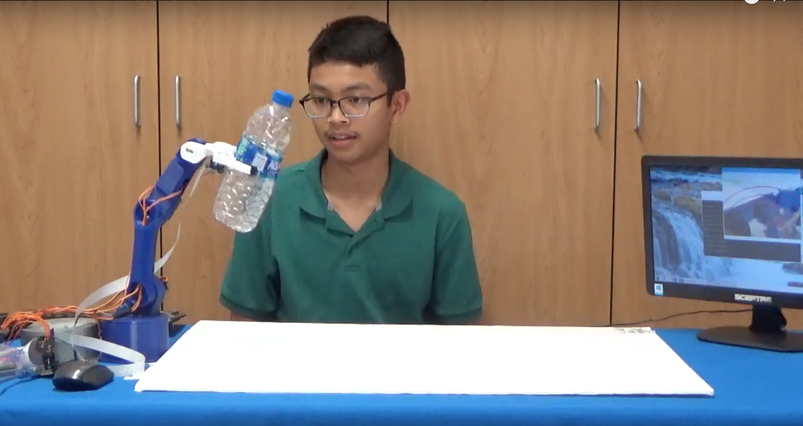
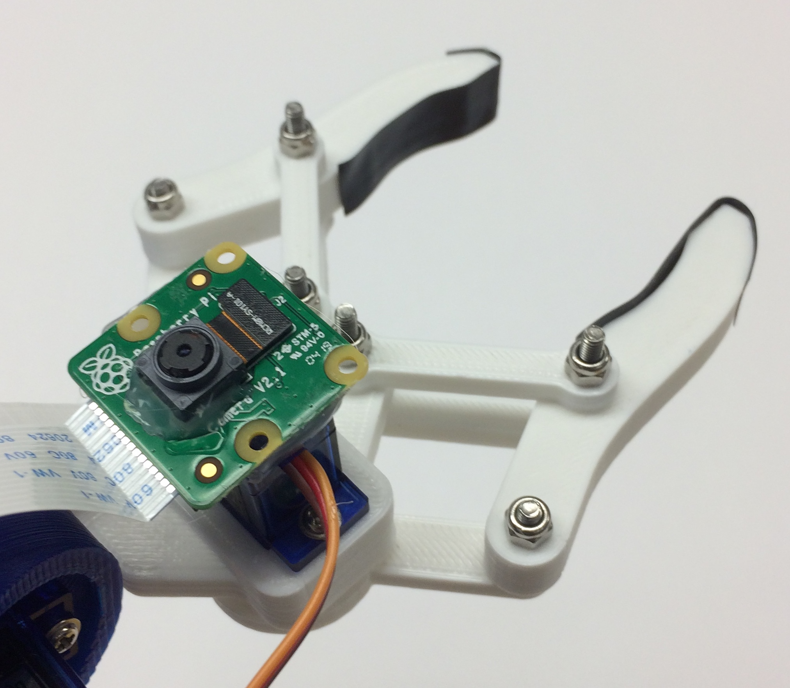
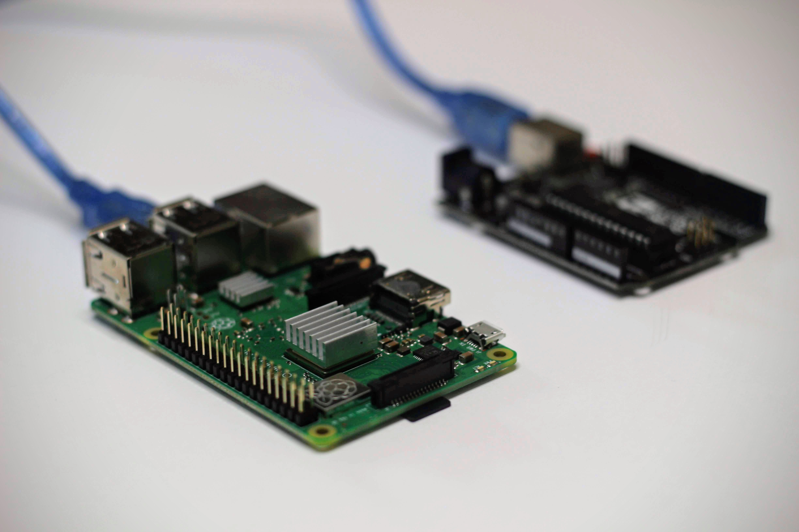
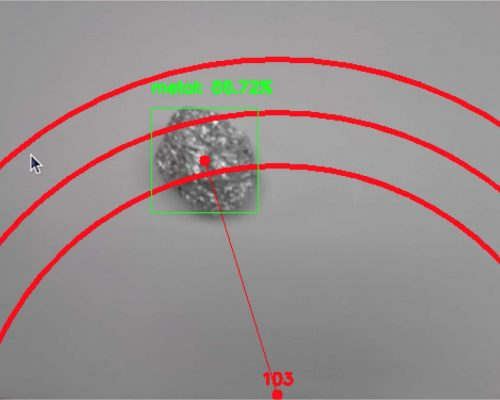

June 2019 - July 2019

## [GitHub Repository](https://github.com/bandofpv/Trash_Sorting_Robot)

## Introduction

Did you know that the average contamination rate in communities and businesses range up to 25%? That means one out of every four pieces of recycling you throw away doesn’t get recycled. This is caused due to human error in recycling centers. Traditionally, workers will sort through trash into different bins depending on the material. Humans are bound to make errors and end up not sorting the trash properly, leading to contamination. As pollution and climate change become even more significant in today’s society, recycling takes a huge part in protecting our planet. By using robots to sort through trash, contamination rates will decrease drastically, not to mention a lot cheaper and more sustainable. To solve this, I created a recycle sorting robot that uses machine learning to sort between different recycle materials.

### Demo Video

## Demo Night Presentation

WIP!!!

## Final Milestone

### Video

VIDEO!!!

### Documentation

Today, I was able to complete my final milestone which was to mount all my components into a project box, enable the Edge TPU’s maximum frequency, and to make my robotic arm more accurate.

I decided to use an aluminum project box that was just big enough to fit my Arduino, Raspberry Pi, and my Coral Edge TPU USB Accelerator. Aluminum is great because it acts like a huge heat sink for my components. In order to mount all my hardware in my project box, I used brass standoffs to better help cool my components.

The two main parts that would get hot in my project would be my RPI and my TPU. These components are in charge of processing the object detection and thus are under a lot of computation load. Even when mounting my RPI outside of my case, It still gets hot. This is why I used a total of four fans to help use active cooling instead of passive cooling with my heat sinks. Now, I have passive and active cooling to help cool all my components. The four fans all run on 12 volts, so I had to get another power supply and solder all the fan wires into a bullet connector for my power supply. With the fans on, I noticed that my RPI barley got hot even after running object detection for a while. Usually, it gets hot and can cause burns, but with the fans, It was only a little warm. Below are pictures of my project box.

After mounting all my components in a project box with fans, I was also able to enable the maximum frequency the Coral Edge TPU can operate at. When installing the edgetpu API, there is a feature that you can enable the setting to make the TPU run at a higher frequency than default. This will allow for better frames per second than if running the TPU at a lower frequency. Using this feature, I was able to get one more frame faster than before. I achieved an average of 15.5 fps which is better than my previous 14.5 fps using the default frequency. 

I also was able to make my robotic arm more accurate. This was done by adding more distance presets. As explained during my Third Milestone, I used distance presets to pick up the detected object based on how far it was from my robotic arm. By adding more, it would become even more precise and accurate. Below is an image showing more preset circles from the video feed.

I would still like to add even more modifications to my project. For example, I’m thinking of adding a relay switch to automatically turn on and off my cooling fans based on how hot my CPU was. If my CPU passes a certain temperature, the RPI will send a signal to my relay to switch my cooling fans on. This will prevent wearing out my cooling fans because they will only turn on when needed.

### [GitHub Commit](https://github.com/bandofpv/Trash_Sorting_Robot)

## Third Milestone

### Video

### Documentation

Today, I completed my third milestone which was to connect my Raspberry Pi to my Arduino using USB-to-Serial communication so my robotic arm can pick up the recognized piece of recycling and drop it according to its material type. 

The first step was to mount my RPI camera to my robotic arm so that it can perform object detection. This was done by simply hot gluing the camera to the bottom of my clamping servo of the robotic arm. When the robotic arm is in its default or home position, the camera will be facing directly below the robotic arm. Below is a picture of my camera mounted on my robotic arm.

Next, I had to connect the Arduino and RPI together via a USB cable in order to perform USB-to-Serial communication. The image below shows how I connected my RPI to my Arduino. I reprogrammed the RPI and Arduino to enable communication between each other. On the Arduino, this can easily be done using the built-in Serial functions, like Serial.begin(). This starts serial communication from the USB. Being able to test the Arduino’s serial communication was made easy due to the Arduino IDE’s serial monitor. You can receive and send data via serial communication. By replicating data signals that would come from the RPI, I was able to quickly debug and program the robotic arm.

To program the robotic arm, I assigned variables to store values coming from the RPI. These included the type of material it detected, it’s distance, and which angle the base servo motor needs to turn. With this information, I simply created functions that essentially take the data from the RPI and pick up the object. I experienced many issues trying to get the robotic arm to pick up an object based on its location. My first attempt was to use something called inverse kinematics. 

Inverse kinematics for a robotic arm is a mathematical process of inputting a coordinate in a 3D plane and then calculates angles at which each joint of the robotic arm needs to turn in order to reach that coordinate. I originally found a library for the Arduino that can do inverse kinematics and translate that to angles that each servo needs to turn. Unfortunately, this library was not very good and didn’t include in-depth documentation on how to use the library. I also noticed that the Arduino has very limited processing power, taking forever to get an output after it process through all the mathematical formulas. I wondered if the RPi could run the inverse kinematics instead. I finally decided that this wasn’t worth it due to the lack of computing power of the RPI CPU. If I were to perform inverse kinematic calculations on the RPI, it would eat away at the CPU load. Overall, making my object detection slower and less efficient. Thus, I decided to use a different solution to this problem. 

My solution would be to program three presets for each distance increment. Due to the limitations of my servos, only able to go from angle 0 to 180, I was very limited to which areas the robotic arm can pick up an object on the ground. This made the process a little bit easier with my preset solution. These presets would represent three intervals at which distances the robotic arm can pick up an object. With these presets, I can now start programming the RPI. 

In terms of serial communication, I was able to use the serial library in python. I was able to start serial communication and begin to transmit and receive data with the Arduino. This process was a bit confusing because when I tested serial communication with the Arduino and RPI with basic code that can allow me to blink an LED from the RPI’s command line, the code worked perfectly. As soon as I added the tensorflow code to the serial communication code, I consistently observed errors. I later noticed that all the serial data I received started with a b’…’ where … is the string received from the Arduino to the RPI. I later found out that I had to use the .decode() method in order to decode the bytestring (b’…’) to a normal string (…). I also had to make sure I converted all my data from the RPI to the Arduino is in UTF-8. After fixing this, I was able to successfully transmit and receive data via USB-to-Serial communication. Now that I can successfully communicate with my Arduino from my RPI, I can move onto finding a way for my robotic arm to pick up the object based off where it’s located in the video feed. 

My first step in doing this is to find the center of the detected object. One might think it is already given, but the object detection API only provides the coordinates of the opposite two corners of the bounding box around the object detected. Using some math, I was able to find the center point of the detected object. This is important, so the robotic arm can grab the center part of the object and not the ends and possibly dropping it. With the center coordinate, I now need to calculate the distance and the angle at which the robotic arm needs to move to pick up the object. 

To find the distance and the angle, I needed to create a point that is in the video feed to represent the location of the robotic arm. After creating this point, I can use the distance formula and trigonometry to calculate the distance and angle from the object detected and the robotic arm. Using trigonometry, I was only able to calculate an angle less than 90 degrees. I later found a way to convert these angles to degrees from 0 to 180 (angles that the servo can turn) with more math. With the distances, I later had to create conditional statements comparing the calculated distances with the robotic arm presets. 

If the calculated distance was closer to a certain preset than the RPI will tell the Arduino what preset the robotic arm needs to move. I then had to create conditional statements for all five types of materials. For example, if plastic is detected for more than 20 frames than the RPI will send the material type, distance, and angle to the robotic arm. The Arduino will later parse that data and store them into variables as stated earlier. With those values, the Arduino will move the robotic arm to pick up and drop off the object. After it is done with the job, the Arduino will later send a string saying “Done Moving” to the RPI to let it know it’s ready to detect more recycling materials. This process was as easy as it seems. My biggest issue was calibrating the robotic arm movement with what is displayed on the camera. 

The camera wasn’t perfectly attached on the robotic arm and every little tilt of the camera would ruin the alignment. I also had to reprogram my robotic arm presets because I didn’t realize that the camera did not provide a wide enough angle and had a very narrow field of view causing my original presets to pick up something that wasn’t in the video feed. To calibrate the two, I first created three new presets that were in the video feed. I would then trace the circular movements of the robotic arm presets creating three circles. By drawing these circles, I can now align those circles with the video feed. This process was not straightforward because it was all trial and error. You can see an image of the three circles in the video feed below.

After calibrating and fixing any errors, I was able to get a working robot that can successfully recognize, pick up, and drop off an object in the location based on its material.

### [GitHub Commit](https://github.com/bandofpv/Trash_Sorting_Robot/tree/1b19374ca5f60976067297c0db9f57e57c58f470)

## Second Milestone

### Video

### Documentation

Today, I finished my second milestone which was to build and program my robotic arm. My robotic arm plays a key part in my project by picking up different recyclables and sorting them depending on its material. 

The first step in completing this milestone was to get all my 3D printed parts printed and ready. Luckily, I found a predesigned 3D printed arm that I found decently compatible with my application. The 3D printed parts were printed out of a material called PLA (Polylactic Acid). It is very cheap and most well-known material for 3D printing. It is also strong enough for my project. After getting all my 3D printed parts, I had to assemble it with my servos. 

I used a total of six servos. Three heavy metal geared servos and three 9 gram plastic geared servos. The three metal geared servos will be used to pivot the base of the arm and to move the lower two joints of the arm. The reason why I used metal geared servos for these parts of the arm is because those joints have to support all the weight of the arm and the object it is holding. Metal geared servos are a lot stronger and more robust than plastic geared motors due to the material of the gears. Plastic geared servos also tend to have a lower torque than metal geared servos. The only benefit is that they are much smaller and lighter. I used the 3 plastic geared servos for the top three joints of the arm including the clamping mechanism for this reason.

There were two different versions of the metal geared servo. One with high torque and one with high speed. In my project, I chose the servo with high torque, overall sacrificing the speed at which it rotates. This is done by the gear configuration in the servo. With higher torque, I can carry heavier objects. In order to control the servos of my robotic arm, I used an Arduino UNO. 

The Arduino UNO is a microcontroller that can be easily programmed on the Arduino IDE. Microcontrollers allow you to receive and transport signals to different peripherals such as sensors and in my project servos. There are three wires that come out of the servo. 

One is ground, then 5 volts, and then the signal. The 5v and ground wires are just used to power the servo motor while the signal wire is used to connect with the Arduino and control the servo. The servo can be controlled using a communication protocol called PWM, Pulse Width Modulation. 

Modulation is the act of modifying or changing a frequency. In PWM it changes the width of each pulse in the digital signal. Digital signals can be thought of either on or off. Using PWM, the digital signal consists of pulses, turning on or off but at certain times. In PWM, there is something called duty cycle. Duty cycle is measured in percent of how long each pulse is in the on position. For example, a duty cycle of 70% means that the signal is 70% on and 30% off. The image below helps visualize this.

The Arduino can actually send PWM signals thanks to the built-in Servo library. With this library, all you have to do is assign the servo to a pin and set the degree at which you want it to turn to. With its pre-built functions, being able to control a servo with the Arduino is simple. 

Building the robotic arm was a big challenge due to the lack of documentation on building some parts of the arm. I found it extremely difficult to build the clamping mechanism. I wasn’t sure how to construct it because I was only provided with one picture of how it should look like. I was able to use washers for the clamping mechanism joints in order to reduce friction, taking off stress from the servo. Calibrating the clamp for my servo was the next hurdle because I need to make sure that when the servo is turned all the way, the clamp would be fully closed. If I didn’t do this, the clamp would never be able to close.

