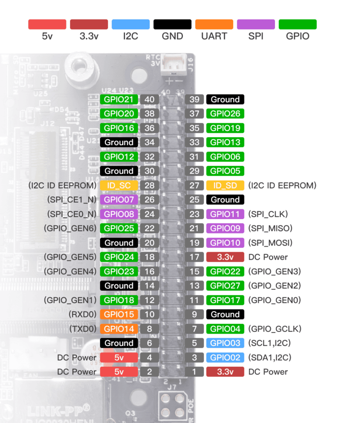

import Tabs from '@theme/Tabs';
import TabItem from '@theme/TabItem';

# Hardware Setup

MAVROSPY is supported on a PX4 (v1.15.2) flight controller with a RPi4 (Ubuntu 22.04 MATE) or Jetson Nano (JetPack 4.6) companion computer. Additionally, it supported on ROS2 Humble and ROS1 Noetic.

PX4 allows interaction with a companion computer via `OFFBOARD` mode. Make sure to setup an `OFFBOARD` mode switch and an `Emergency Kill` switch in [QGroundControl](https://docs.qgroundcontrol.com/master/en/qgc-user-guide/index.html).

If you haven't already, please install [Ubuntu MATE 22.04](https://releases.ubuntu-mate.org/22.04/arm64/) for the RPi4 (arm64) or [JetPack 4.6](https://developer.nvidia.com/embedded/jetpack-sdk-46) for the Jetson Nano using the [Raspberry Pi Imager](https://www.raspberrypi.com/software/).

Select the `Log in automatically` option upon first boot.

## Wiring

This tutorial uses the flight controller's `TELEM2` port to communicate with the companion computer.

<Tabs groupId="companion-computers">
  <TabItem value="rpi" label="RPi4">
    Connect the flight controller's `TELEM2` `TX`/`RX` pins to the complementary `RXD`/`TXD` pins on the RPi4 GPIO board:

    | PX4 TELEM2 Pin | RPi4 GPIO Pin          |
    |----------------|------------------------|
    | UART5_TX (2)   | RXD (GPIO 15 - pin 10) |
    | UART5_RX (3)   | TXD (GPIO 14 - pin 8)  |

    This diagram shows the RPi4 GPIO board pinout:

    <div align="center">
    
    </div>

    The standard `TELEM2` pin assignments are shown below:

    | Pins      | Signal          | Voltage |
    |-----------|-----------------|---------|
    | 1 (Red)   | VCC (out)       | +5V     |
    | 2 (Black) | UART5_TX (out)  | +3.3V   |
    | 3 (Black) | UART5_RX (in)   | +3.3V   |
    | 4 (Black) | UART5_CTS (out) | +3.3V   |
    | 5 (Black) | UART5_RTS (in)  | +3.3V   |
    | 6 (Black) | GND             | GND     |

    The RPi4 requires a separate 5V/3A power supply via the `5V power` (pin 4) and `Ground` (pin 6). I would recommend soldering a battery elimination circuit (BEC) or Polulu voltage regulator to your UAV's power leads.
  </TabItem>

  <TabItem value="jetson" label="Jetson Nano">
    The Jetson Nano should theoretically be able to communicate with the flight controller via the GPIO pins. However upon testing, the Jetson Nano struggles to communicate with the flight controller due to a possibly noisy data link. I would recommend using a USB to UART adapter to communicate with the flight controller.

    Connect the flight controller's `TELEM2` `TX`/`RX` pins to the complementary `RXD`/`TXD` pins on the USB to UART adapter:

    | PX4 TELEM2 Pin | USB To UART Adapter Pin |
    |----------------|-------------------------|
    | UART5_TX (2)   | RXD                     |
    | UART5_RX (3)   | TXD                     |

    The standard `TELEM2` pin assignments are shown below:

    | Pins      | Signal          | Voltage |
    |-----------|-----------------|---------|
    | 1 (Red)   | VCC (out)       | +5V     |
    | 2 (Black) | UART5_TX (out)  | +3.3V   |
    | 3 (Black) | UART5_RX (in)   | +3.3V   |
    | 4 (Black) | UART5_CTS (out) | +3.3V   |
    | 5 (Black) | UART5_RTS (in)  | +3.3V   |
    | 6 (Black) | GND             | GND     |

    The Jetson Nano requires a separate 5V/3A power supply via the `5V power` (pin 4) and `Ground` (pin 6). I would recommend soldering a battery elimination circuit (BEC) or Polulu voltage regulator to your UAV's power leads.

    This diagram shows the Jetson Nano GPIO board pinout:

    <div align="center">
      
    </div>

  </TabItem>
</Tabs>


## PX4 Parameters

Assuming you have installed the latest PX4 
[firmware](https://docs.px4.io/main/en/config/firmware.html#install-stable-px4), change the following 
[parameters](https://docs.px4.io/main/en/advanced_config/parameters.html) in QGroundControl:

```
   MAV_1_CONFIG = TELEM2
   UXRCE_DDS_CFG = 0
   SER_TEL2_BAUD = 921600
```

## Setting up SSH

SSH allows us to remotely issue commands to the companion computer over Wi-Fi.

Install the `openssh-server` package on your companion computer:

```bash
$ sudo apt update
$ sudo apt install -y openssh-server net-tools
```

The SSH service will start automatically. We can verify this by entering:

```bash
$ sudo systemctl status ssh
```

You should see `Active: active (running)` somewhere in the status report. **CTRL+C** to exit.

On your publishing computer, SSH to your companion computer. Make sure you change `username` to your companion computer's username and `ip_address` to your companion computer's IP address:

```bash
$ ssh username@ip_address
```

Remember, you can always check your IP address via:

```bash
$ ifconfig
```

If you forget your username, you can alway run:

```bash
$ echo $USER
```

We can now issue commands to our companion computer via SSH rather than having it hooked up to a monitor with a mouse and keyboard.

## Enable UART (RPi4 Only)

Open the firmware boot configuration file:

```bash
$ sudo nano /boot/firmware/config.txt
```

Append the following text to the end of the file (after the last line):

```bash
enable_uart=1
dtoverlay=disable-bt
```

Save and exit the file.

## Test Connection

[MAVLink](https://mavlink.io/en/) is the default and stable communication interface for working with PX4.

We can test that the companion computer and flight controller are communicating with each other via a MAVLink GCS called `mavproxy`.

Run this command to add your user to the `dialout` group:

```bash
$ sudo adduser ${USER} dialout
```

Restart your companion computer.

<Tabs groupId="companion-computers">
  <TabItem value="rpi" label="RPi4">
    You can check that the serial port is available by issuing this command:

    ```bash
    $ ls /dev/serial0
    ```

    The result of the command should include the RX/TX connection `/dev/serial0`

    Install MAVProxy:

    ```bash
    $ sudo apt install -y python3-pip
    $ sudo pip3 install mavproxy
    $ sudo apt remove -y modemmanager
    ```

    Run MAVProxy, setting the port to connect to `/dev/serial0` and the baud rate to match the flight controller (921600):

    ```bash
    $ sudo mavproxy.py --master=/dev/serial0 --baudrate 921600
    ```

    MAVProxy on the RPi4 should now connect to the flight controller via its RX/TX pins. You should be able to see this in the terminal. **CTRL+C** to exit.

  </TabItem>

  <TabItem value="jetson" label="Jetson Nano">
    You can check that the serial port is available by issuing this command:

    ```bash
    $ ls /dev/ttyUSB0
    ```

    The result of the command should include the RX/TX connection `/dev/ttyUSB0`

    Install MAVProxy:

    ```bash
    $ sudo apt install -y python3-pip
    $ sudo pip3 install mavproxy
    $ sudo apt remove -y modemmanager
    ```

    Run MAVProxy, setting the port to connect to `/dev/ttyUSB0` and the baud rate to match the flight controller (921600):

    ```bash
    $ sudo mavproxy.py --master=/dev/ttyUSB0 --baudrate 921600
    ```

    MAVProxy on the Jetson Nano should now connect to the flight controller via its RX/TX pins. You should be able to see this in the terminal. **CTRL+C** to exit.

  </TabItem>
</Tabs>

## Install Docker

Installing [Docker](https://www.docker.com/) on Ubuntu is very easy and will allow us to build the ROS environment onto the companion computer in just a few steps.

This is a summarized version of the offical [installation insructions](https://docs.docker.com/engine/install/ubuntu/#installation-methods).

<Tabs groupId="companion-computers">
  <TabItem value="rpi" label="RPi4">
    Setup Docker's `apt` repsitory:

    ```bash
    $ sudo apt install -y ca-certificates curl
    $ sudo install -m 0755 -d /etc/apt/keyrings
    $ sudo curl -fsSL https://download.docker.com/linux/ubuntu/gpg -o /etc/apt/keyrings/docker.asc
    $ sudo chmod a+r /etc/apt/keyrings/docker.asc
    $ echo \
      "deb [arch=$(dpkg --print-architecture) signed-by=/etc/apt/keyrings/docker.asc] https://download.docker.com/linux/ubuntu \
      $(. /etc/os-release && echo "$VERSION_CODENAME") stable" | \
      sudo tee /etc/apt/sources.list.d/docker.list > /dev/null
    $ sudo apt update
    ```

    Install the Docker packages:

    ```bash
    $ sudo apt install -y docker-ce docker-ce-cli containerd.io docker-buildx-plugin docker-compose-plugin
    ```

    Create the `docker` group if not already created:

    ```bash
    $ sudo groupadd docker
    ```

    Add your user to the `docker` group:

    ```bash
    $ sudo usermod -aG docker $USER
    ```

    Restart so that your group membership is re-evaluated.

    We can verify our Docker installation via:

    ```bash
    $ docker run hello-world
    ```
  </TabItem>

  <TabItem value="jetson" label="Jetson Nano">
    Jetpack already comes with Docker installed!

    Add your user to the `docker` group:

    ```bash
    $ sudo usermod -aG docker $USER
    ```

    Restart so that your group membership is re-evaluated.

    We can verify our Docker installation via:

    ```bash
    $ docker run hello-world
    ```
  </TabItem>
</Tabs>

## Build MAVROSPY Docker image

Now that Docker is installed properly, we can build our Docker image and run it in a Docker container.

Clone the `mavrospy` repository:

<Tabs groupId="ros-version">
  <TabItem value="ros2" label="ROS2">
    ```bash
    $ cd ~
    $ git clone -b ros2 https://github.com/bandofpv/mavrospy.git
    ```
  </TabItem>

  <TabItem value="ros1" label="ROS1">
    ```bash
    $ cd ~
    $ git clone -b ros1 https://github.com/bandofpv/mavrospy.git
    ```
  </TabItem>
</Tabs>

<Tabs groupId="companion-computers">
  <TabItem value="rpi" label="RPi4">
    Build via the `run_docker.sh` script:

    ```bash
    $ cd ~/mavrospy/docker/rpi
    $ bash run_docker.sh
    ```

    The script will automatically start building the MAVROSPY docker image and run it in a container.

    **CTRL+D** to exit the container.
  </TabItem>

  <TabItem value="jetson" label="Jetson Nano">
    Build via the `run_docker.sh` script:

    ```bash
    $ cd ~/mavrospy/docker/jetson
    $ bash run_docker.sh
    ```

    The script will automatically start building the MAVROSPY docker image and run it in a container.

    **CTRL+D** to exit the container.
  </TabItem>
</Tabs>
