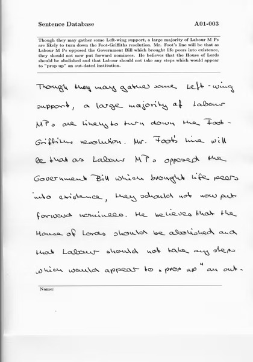
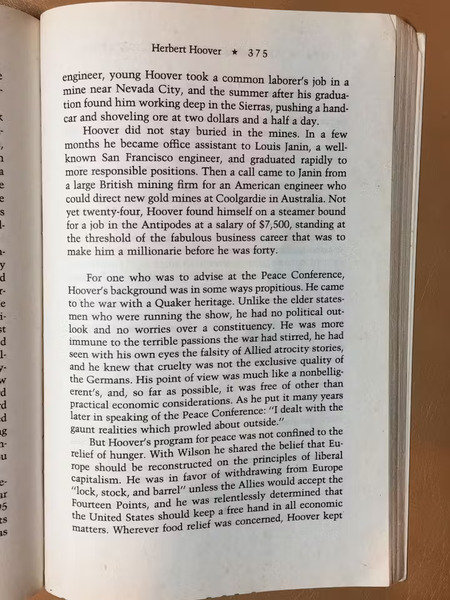
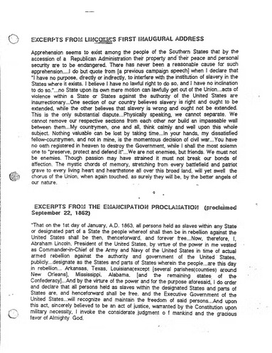
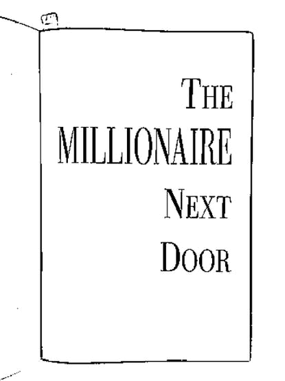

import ReactPlayer from 'react-player'

# Reading Eye For The Blind

December 2019 - February 2020

## Story

The World Health Organization (WHO) estimates that there are 285 million people that are visually impaired. Specifically in the United States, there are 1.3 million who are legally blind and only 10 percent of them can actually read braille and only 10 percent of the blind children are learning it. This is due to how expensive books are to read in braille. It costs up to $15,000 just to convert five chapters of a science book! Due to the price, very few blind people are able to learn through books. People who are reading impaired or suffer vision loss also struggle to read. While many can use audio-books, they are still limited on what they can read based on audio books' availability and costs. Books are the cheapest way to learn and 285 million people are unable to take advantage of this resource we greatly take for granted. The Reading Eye device would allow more freedom in terms of book choice, without having to make investments towards buying several audio-books. It is able to detect printed and handwritten text and speak it in a realistic synthesized voice.

<div align="center">

</div>

My whole inspiration for this project was to help my grandmother who's vision degrades everyday due to age. I then thought of all the others who suffer due to bad vision or reading disabilities which motivated me to pursue this project.

## Demo Video

<div className="video_wrapper">
    <ReactPlayer className="video_player" controls height="100%" width="100%" url="https://www.youtube.com/watch?v=ZVquCjLMWuA"/>
</div>

## Code

+ **[Reading_Eye_For_The_Blind GitHub Repository](https://github.com/bandofpv/Reading_Eye_For_The_Blind)**
+ **[Handwritten_Text GitHub Repository](https://github.com/bandofpv/Handwritten_Text)**

:::note
This tutorial is supported on an [Ubuntu 18.04 LTS](https://releases.ubuntu.com/18.04/) computer.
:::

## Components List

|Qty|Component|
|:---|:---|
|x1|[Nvidia Jetson Nano Developer Kit](https://www.hackster.io/products/buy/68111?s=BAhJIhMzMTU3ODksUHJvamVjdAY6BkVG%0A)|	
|x1|[USB Keyboard and Mouse](https://www.hackster.io/products/buy/69078?s=BAhJIhMzMTU3ODksUHJvamVjdAY6BkVG%0A)|	
|x1|[5V 2.5A Power Supply With Micro USB Cable](https://www.hackster.io/products/buy/69079?s=BAhJIhMzMTU3ODksUHJvamVjdAY6BkVG%0A)|
|x1|[32GB Micro SD Card](https://www.hackster.io/products/buy/69080?s=BAhJIhMzMTU3ODksUHJvamVjdAY6BkVG%0A)|	
|x1|[Computer Display](https://www.hackster.io/products/buy/69081?s=BAhJIhMzMTU3ODksUHJvamVjdAY6BkVG%0A)|
|x1|[Raspberry Pi Camera Module V2](https://www.hackster.io/products/buy/68122?s=BAhJIhMzMTU3ODksUHJvamVjdAY6BkVG%0A)|	
|x1|[Arducam 8MP Wide Angle Drop-in Replacement](https://www.hackster.io/products/buy/68123?s=BAhJIhMzMTU3ODksUHJvamVjdAY6BkVG%0A)|
|x1|[INIU Power Bank](https://www.hackster.io/products/buy/68124?s=BAhJIhMzMTU3ODksUHJvamVjdAY6BkVG%0A)|
|x1|[Edimax Wi-Fi USB Adapter](https://www.hackster.io/products/buy/68125?s=BAhJIhMzMTU3ODksUHJvamVjdAY6BkVG%0A)|
|x1|[USB to 3.5mm Jack Audio Adapter](https://www.hackster.io/products/buy/68126?s=BAhJIhMzMTU3ODksUHJvamVjdAY6BkVG%0A)|
|x1|[2.0 A-Male to Micro B USB Cable](https://www.hackster.io/products/buy/68127?s=BAhJIhMzMTU3ODksUHJvamVjdAY6BkVG%0A)|
|x1|[Mini LED Arcade Button](https://www.hackster.io/products/buy/68128?s=BAhJIhMzMTU3ODksUHJvamVjdAY6BkVG%0A)|
|x1|[Illuminated Toggle Switch with Cover](https://www.hackster.io/products/buy/68129?s=BAhJIhMzMTU3ODksUHJvamVjdAY6BkVG%0A)|
|x1|[Flex Cable for Raspberry Pi Camera](https://www.hackster.io/products/buy/69201?s=BAhJIhMzMTU3ODksUHJvamVjdAY6BkVG%0A)|
|x1|[Noctua NF-A4x20 5V Fan](https://www.hackster.io/products/buy/68963?s=BAhJIhMzMTU3ODksUHJvamVjdAY6BkVG%0A)|
|x1|[M3x25 Screws](https://www.hackster.io/products/buy/68964?s=BAhJIhMzMTU3ODksUHJvamVjdAY6BkVG%0A)|
|x1|[Jumper Wires](https://www.hackster.io/products/buy/69203?s=BAhJIhMzMTU3ODksUHJvamVjdAY6BkVG%0A)|

## 3D Parts
|Qty|Part|
|:---|:---|
|x1|[Lid](https://www.thingiverse.com/download:14552701)|
|x1|[Box](https://www.thingiverse.com/download:14552699)|
|x1|[Camera Mount](https://www.thingiverse.com/download:14552700)|

## Setting Up Your Computer

As stated above, I recommend a clean install of Ubuntu 18.04 LTS. After installing Ubuntu, run this:

```bash
$ sudo apt-get update
$ sudo apt-get upgrade
$ sudo apt-get install python3.6-dev python3-pip git
```

## Training the Handwritten Text Recognition Model

We first need to train a model that can recognize handwritten text. We will be using Tensorflow 2.0 and Google Colab for training. In terms of data, we will use the [IAM Database](http://www.fki.inf.unibe.ch/databases/iam-handwriting-database). This data set comes with more than 9,000 pre-labeled text lines from 500 different writers.

Here is an example from the database:

<div align="center">

</div>

:::tip
To access to the database you gave to register [here](http://www.fki.inf.unibe.ch/DBs/iamDB/iLogin/index.php).
:::

First clone the [Training GitHub Repository](https://github.com/bandofpv/Handwritten_Text) in your home folder of your computer:

```bash
$ cd ~
$ git clone https://github.com/bandofpv/Handwritten_Text.git
```

Next, we need to setup a virtual environment and install the required python modules:

```bash
$ sudo pip3 install virtualenv virtualenvwrapper
$ echo -e "n# virtualenv and virtualenvwrapper" >> ~/.bashrc
$ echo "export WORKON_HOME=$HOME/.virtualenvs" >> ~/.bashrc
$ echo "export VIRTUALENVWRAPPER_PYTHON=/usr/bin/python3" >> ~/.bashrc
$ echo "source /usr/local/bin/virtualenvwrapper.sh" >> ~/.bashrc
$ source ~/.bashrc
$ mkvirtualenv hand -p python3
$ cd ~/Handwritten_Text
$ pip3 install -r requirements.txt
```

Next, we can download the database (replace *your-username* with your username and replace *your-password* with your password from registering):

```bash
$ cd ~/Handwritten_Text/raw
$ USER_NAME=your-username
$ PASSWORD=your-password
$ wget --user $USER_NAME --password $PASSWORD -r -np -nH --cut-dirs=3 -A txt,png -P iam http://www.fki.inf.unibe.ch/DBs/iamDB/data/
$ cd ~/Handwritten_Text/raw/iam/
$ wget http://www.fki.inf.unibe.ch/DBs/iamDB/tasks/largeWriterIndependentTextLineRecognitionTask.zip
$ unzip -d largeWriterIndependentTextLineRecognitionTask largeWriterIndependentTextLineRecognitionTask.zip
$ rm largeWriterIndependentTextLineRecognitionTask.zip robots.txt
```

This is a long process so do something fun and look at memes:

<div align="center">

</div>

After downloading the database, we need to transform it into a HDF5 file:

```bash
cd ~/Handwritten_Text/src
python3 main.py --source=iam --transform
```

This will create a file named iam.hdf5 in the data directory.

Now, we need to open the [training.ipynb](https://colab.research.google.com/github/bandofpv/Handwritten_Text/blob/master/src/training.ipynb) file on Google Colab:

<div align="center">

</div>

Select the **Copy to Drive** tab in the top left corner of the page.

Then, go onto your Google Drive and find the folder named **Colab Notebooks**. Press the **+ New** button on the left and create a new folder named **handwritten-text**. Go into the new folder you created and press the **+ New** button and select the **Folder upload** option. You will need to upload both the src and data folder from our Handwritten_Text directory. You screen should look like this:

<div align="center">

</div>

Go back to the [training.ipynb](https://colab.research.google.com/github/bandofpv/Handwritten_Text/blob/master/src/training.ipynb) tab and confirm that you are hooked up to a GPU runtime. To check, find the **Runtime** tab near the top left corner of the page and select **Change runtime type**. Customize the settings too look like this:

<div align="center">

</div>

Google Colab allows us to take advantage of a Tesla K80 GPU, Xeon CPU, and 13GB of RAM all for free and in a notebook style format for training machine learning models.

To prevent Google Colab from disconnecting to the server, press Ctrl+ Shift + I to open inspector view. Select the **Console** tab and enter this:

```bash
function ClickConnect(){
console.log("Working"); 
document.querySelector("colab-toolbar-button#connect").click() 
}

setInterval(ClickConnect,60000)
```

:::tip
If you get an error about not able to paste into the console, type `allow pasting` as seen below.
:::

<div align="center">

</div>

Now let's start training! Simply find the **Runtime** tab near the top left corner of the page and select **Run All**. Follow through each code snippet until you reach step 1.2 where you will have to authorize the notebook to access your Google Drive. Just click the link it provides you and copy & paste the authorization code in the input field.

You can then let it the notebook run until it finishes training.

Take a look at the Predict and Evaluate section too see the results:

<div align="center">

</div>

<div align="center">

</div>

Now that we are done training, we can enjoy another meme:

<div align="center">

</div>

## Setting Up The Jetson Nano

First, follow NVIDIA's tutorial, [Getting Started With Jetson Nano](https://developer.nvidia.com/embedded/learn/get-started-jetson-nano-devkit#intro).

After booting up, open a new terminal and download the necessary packages and python modules:

:::note
This will take a LONG time!
:::

```bash
$ sudo apt-get update
$ sudo apt-get upgrade
$ sudo apt-get install python3-pip gcc-8 g++-8 libopencv-dev
$ sudo apt-get install libhdf5-serial-dev hdf5-tools libhdf5-dev zlib1g-dev zip libjpeg8-dev gfortran libopenblas-dev liblapack-dev
$ sudo pip3 install -U pip testresources setuptools cython
$ sudo pip3 install -U numpy==1.16.1 future==0.17.1 mock==3.0.5 h5py==2.9.0 keras_preprocessing==1.0.5 keras_applications==1.0.8 gast==0.2.2 enum34 futures protobuf
$ sudo pip3 install --pre --extra-index-url https://developer.download.nvidia.com/compute/redist/jp/v43 tensorflow-gpu==2.0.0+nv20.1
```

This will install OpenCV 4.0 for computer vision, gcc-8 & g++-8 for C++ compiling, and TensorFlow 2.0 to run our handwritten text recognition model. Those are the main ones, but we will also need to install all the other required dependencies:

```bash
$ sudo pip3 uninstall enum34
$ sudo apt-get install python3-matplotlib python3-numpy python3-pil python3-scipy nano
$ sudo apt-get install build-essential cython
$ sudo apt install --reinstall python*-decorator
$ sudo pip3 install -U scikit-image
$ sudo pip3 install -U google-cloud-vision google-cloud-texttospeech imutils pytesseract pyttsx3 natsort playsound 
$ sudo pip3 install -U autopep8==1.4.4 editdistance==0.5.3 flake8==3.7.9 kaldiio==2.15.1
```

We also need to install llvmlite from source in order to install numba:

:::note
This will take an even LONGER time. Treat your self to a nice movie!
:::

```bash
$ wget http://releases.llvm.org/7.0.1/llvm-7.0.1.src.tar.xz
$ tar -xvf llvm-7.0.1.src.tar.xz
$ cd llvm-7.0.1.src
$ mkdir llvm_build_dir
$ cd llvm_build_dir/
$ cmake ../ -DCMAKE_BUILD_TYPE=Release -DLLVM_TARGETS_TO_BUILD="ARM;X86;AArch64"
$ make -j4
$ sudo make install
$ cd bin/
$ echo "export LLVM_CONFIG=\""`pwd`"/llvm-config\"" >> ~/.bashrc
$ echo "alias llvm='"`pwd`"/llvm-lit'" >> ~/.bashrc
$ source ~/.bashrc
$ sudo pip3 install -U llvmlite numba
```

Next, you need to plug in the WiFi USB adapter into any of the USB ports:

<div align="center">

</div>

You then need to turn off power save mode to prevent the WiFi network from dropping out:

```bash
sudo iw dev wlan0 set power_save off
```

In order to take advantage of Google Cloud's Vision and Text-to-Speech APIs, we need to create an [account](https://cloud.google.com/). It will require you to enter your credit card, but don't worry, you get $300 free! Next go to your [GCP Console](https://console.cloud.google.com/) and create a new project with any name using the following steps.

1. Go to the [Cloud Console API Library](https://console.cloud.google.com/apis/library?project=_) and click on **Select your project**.
2. On the search bar enter `Vision`.
3. Select **Cloud Vision API** and click **Enable**.
4. Go back to the [Cloud Console API Library](https://console.cloud.google.com/apis/library?project=_) and enter `Text to Speech` in the search bar.
5. Select `Cloud Text-to-Speech API` and click **Enable**.
6. On the [Google Cloud Service accounts page](https://console.cloud.google.com/iam-admin/serviceaccounts/) click on **Select your project** and select **Create Service Account**.
7. Designate the **Service account name** and click **Create**.
8. Under **Service account permissions** click **Select a role**.
9. Scroll to *Cloud Translation* and select *Cloud Translation API Editor*. Select **Continue**.
10. Click **Create Key**, select **JSON**, and click **Create**.

This will create a .json file that will allow your Jetson Nano to connect to your cloud project.

We also need to check the name of our Google Cloud Project ID. Go to your [GCP Console](https://console.cloud.google.com/) on the **Project info** section, you will see *ProjectID*. This is your Project ID. We will use it soon.

Now we can clone the [Reading_Eye_For_The_Blind GitHub Repository](https://github.com/bandofpv/Reading_Eye_For_The_Blind):

```bash
$ git clone https://github.com/bandofpv/Reading_Eye_For_The_Blind.git
```

Remember the handwritten text recognition model we trained earlier?
Now we need to save it into our Reading_Eye_For_The_Blind directory.

Go back to the *handwritten-text* Google Drive folder:

<div align="center">

</div>

Right click on the output folder and click `Download`. This is our model that we trained. Move it to our directory and rename it (change *name-of-dowloaded-zip-file* to the name of the downloaded zip file):

```bash
$ export YOUR_DOWNLOAD=name-of-dowloaded-zip-file
$ unzip ~/Downloads/$YOUR_DOWNLOAD -d ~/Reading_Eye_For_The_Blind
$ mv ~/Reading_Eye_For_The_Blind/output ~/Reading_Eye_For_The_Blind/model
```

To make the our program run on the Jetson Nano every time we turn it on we need to create an *autostart* directory:

```bash
$ mkdir ~/.config/autostart
```

We need to move [ReadingEye.desktop](https://github.com/bandofpv/Reading_Eye_For_The_Blind/blob/master/ReadingEye.desktop) into our new directory:

```bash
$ mv ~/Reading_Eye_For_The_Blind/ReadingEye.desktop ~/.config/autostart/
```

We also need to update the environmental variables in our file:

```bash
nano ~/.config/autostart/ReadingEye.desktop
```

You then want to find USERNAME and replace it with the username of your Jetson Nano 

:::note
There are two occurrences of USERNAME, change both!.
:::

Next we need to connect a camera to the Jetson Nano. I used a [Raspberry Pi Camera Module V2](https://www.amazon.com/Raspberry-Pi-Camera-Module-Megapixel/dp/B01ER2SKFS/ref=pd_bxgy_2/137-9852188-5881617?_encoding=UTF8&pd_rd_i=B01ER2SKFS&pd_rd_r=84410404-fc53-4886-9e88-36bf54ffac8e&pd_rd_w=Cm26g&pd_rd_wg=goybO&pf_rd_p=fd08095f-55ff-4a15-9b49-4a1a719) with a [wide angle lens attachment](https://www.amazon.com/Arducam-Replacement-Raspberry-Degrees-Diagonal/dp/B07V322VCX?th=1).

Simply remove the original lens and attach the wide angle one. It should look like this:

<div align="center">

</div>

Connect the ribbon cable to the Jetson Nano's camera connector:

:::note
Make sure to use a [longer ribbon cable](https://www.adafruit.com/product/1730) than the original one provided.
:::

<div align="center">

</div>

Install a fan to the Jetson Nano to prevent it from throttling during heavy computing. We will use a [Noctua 5V Fan](https://www.amazon.com/Noctua-NF-A4x20-5V-PWM-Premium-Quality/dp/B071FNHVXN/ref=as_li_ss_tl?crid=27DIIHQ63FHYV&keywords=noctua+a4x20+5v+pwm&qid=1567903014&s=gateway&sprefix=noctua+A4,aps,390&sr=8-1-spons&psc=1&spLa=ZW5jcnlwdGVkUXVhbGlmaWVyPUExTFgwSUo2VERR), which is extremely quiet and efficient. Use [M3x25 screws](https://www.getfpv.com/m3x25-12-9-grade-steel-screw-set-50pcs.html) to mount the fan into the mounting holes, then plug the cable into the fan header:

<div align="center">

</div>

We can start soldering the power switch and start button. The power switch is a toggle switch with a LED light. Solder female jumper wires to the three pins 

:::warning
Pay close attention to the pin labels! I accidentally swapped the ground and light pins as seen in the photos. The pin sticking on the side is the ***ground***, the pin with a **+** is the ***signal pin***, and the pin with a strange light symbol is the ***light pin***.
:::

<div align="center">

</div>

For the start button it can be more complicated because we will have to setup a pull up resister circuit with the button. Here is a schematic:

<div align="center">

</div>

Solder a *ground* jumper wire to the **-** pin, a *signal* jumper wire to the **+** pin, and a *10k resistor* to the **+** pin on the start button too. Next, solder a *power* jumper wire to the resistor. This will plug into the 3.3V pin on the Jetson Nano.

We also need to solder the LED pins on the start button too. Just solder a power jumper wire to the **+** light pin and a *ground jumper* wire to the **-** light pin. This is how mine looks like:

<div align="center">

</div>

We can now connect the power switch and start button to the correct pins. Here is a schematic:

<div align="center">

</div>

Note the jumper on the top of the J40 header.

Great job! Enjoy a meme:

<div align="center">

</div>

## Building The Enclosure

3D print the CAD files included at the [bottom of this tutorial](https://www.hackster.io/bandofpv/reading-eye-for-the-blind-with-jetson-nano-8657ed#cad). We need to fit all our electronics into this box. I used double sided foam tape to mount the the power pack to the bottom. You want to make sure it is orientated properly:

<div align="center">

</div>

Next, we need to mount the Jetson Nano on top of the battery pack and connect the USB cable between the two:

<div align="center">

</div>

Plug in the USB to audio audio adapter and hot glue it to the side hole:

<div align="center">

</div>

Next, mount the power toggle switch and start button to the lid and plug it into the correct ports on the Jetson Nano:

<div align="center">

</div>

Finally, glue the lid to the box using super glue. Make sure that the camera is outside the box mount it to the camera mount using hot glue.

<div align="center">

</div>

## Have Fun

Now that we're done with the build have fun and start detecting! Plug in your favorite pair of earphones to the audio jack and place some text under the camera, toggle the power switch up and down, and click the start button.

To detect printed text, press the start button once. To detect handwritten text, double click the start button.

## Understanding The Code

Now for the even more fun part. Code!!!

All code can be found on both GitHub Repositories:

+ [Reading_Eye_For_The_Blind GitHub Repository](https://github.com/bandofpv/Reading_Eye_For_The_Blind)
+ [Handwritten_Text GitHub Repository](https://github.com/bandofpv/Handwritten_Text)

There is a lot of code used in this tutorial and I will explain the fundamentals. My explanations will be very broad, so if you want to learn more about how my code works, take a look at my GitHub Repositories above or ask me in the comment section.

Lets start with a flow chart:

<div align="center">

</div>

This will help understand the basics of what goes on. I decided to tryout Google's Cloud Vision and TTS API in this project. It allows you to use cloud computing to perform both printed and handwritten text recognition and text to speech. However, because the purpose of the Jetson Nano is to promote AI at the Edge, I programmed it to perform both printed and handwritten text recognition and text to speech without internet connection as well.

Let's go into each step in depth.

The first step is to check if the Jetson Nano is connected to internet:

```python
def check_internet(host='http://google.com'):
    try:
        urllib.request.urlopen(host)
        return True
    except:
        return False
```

By using the urllib module, we can attempt to connect to [google.com](https://www.google.com/). If it can connect to Google, then it returns that it has internet connection. If not, then it will return that it does not have internet connection.

After checking if the Jetson Nano has internet connection, it will take a picture using OpenCV:

<div align="center">

</div>

But as seen above, the picture has this *fisheye* effect due to the wide angle lens. To correct for this, we can use OpenCV again to get a much better picture:

<div align="center">

</div>

Next, if the Jetson Nano has internet connection, it will connect to the Google Cloud and use the Vision and Text-to-Speech APIs to recognize both printed and handwritten text and synthesize it to speech.

However, if the Jetson Nano does not have internet connection, it will have to rely on its CPU and GPU to recognize printed and handwritten text and synthesize it to speech.

Let's start with printed text because its easiest to understand. The Jetson Nano will first attempt to detect a page in the photo. This is done using OpenCV's edge detection:

<div align="center">

</div>

If it detects a page, then it will transform it into a top-down view:

<div align="center">

</div>

However, if the Jetson Nano does not detect a page, it will think its detecting text from a book. In this case, it will just convert it into grayscale and perform adaptive thresholding to remove shadows:

<div align="center">

</div>

After preprocessing the image into a picture ready for printed text recognition, we will use PyTesseract:

```python
text = pytesseract.image_to_string(img)
```

Next, we will use pyttsx3 to synthesize the recognized text into speech:

```python
engine = pyttsx3.init()
engine.setProperty('voice', "en-us+f5")
engine.say(text)
```

Now for the handwritten text. Handwritten text is much harder to detect then printed text because unlike typed text, handwriting is never perfectly legible and requires the human brain to infer what word you are reading. This gives the Jetson Nano an even harder time to recognized handwritten text.

At the beginning of this tutorial, we trained our own handwritten text recognition model using Google Colab. I will briefly explain how this works.

Using the [IAM Database](http://www.fki.inf.unibe.ch/databases/iam-handwriting-database), with more than 9,000 pre-labeled text lines from 500 different writers, we trained a handwritten text recognition:

<div align="center">

</div>

Through Deep Learning, we fit our data set into the Convolutional Recurrent Neural Network (CRNN) which can overcome some limitations of a traditional Hidden Markov Model (HMM):

<div align="center">

</div>

First, the input image is fed through the Convolutional Neural Network (CNN) layers which will extract the relevant features from the image. Each layer consists of three operations:

1. Convolution Operation
2. Non-Linear RELU Function
3. Pooling

Next, the output feature map from the CNN layers will be fed into the Recurrent Neural Network (RNN) which will propagate relevant information through longer distances, providing more robust training.

Finally, the Connectionist Temporal Classification (CTC) will calculate loss value and decodes the RNN output sequence into the final text.

Below is an image that goes into more detail of the RNN layers.

<div align="center">

</div>

That's the most detail I will include in this tutorial because its relatively complicated and too long to add a full description in this tutorial. Again, ask in the comments if you have any questions.

Now that you somewhat understand the basics of our handwritten text recognition model, you could also notice that it can only detect words on one single line. This is where text segmentation comes to play.

The text segmentation process starts just like the printed text. It attempts to find a page and perform four-point perspective transformation:

<div align="center">

</div>

Then comes the binarization. There are a few techniques to perform this:

+ A Threshold Selection Method from Gray-Level Histograms (Otsu)
+ An Introduction to Digital Image Processing (Niblack)
+ Adaptive Document Binarization (Sauvola)
+ Text Localization, Enhancement, and Binarization in Multimedia Documents (Wolf)
+ Binarization of Historical Document Images Using the Local Maximum and Minimum (Su)

<div align="center">

</div>

You may notice that the images are still quite distorted due to shadows. This is where Illumination compensation will come to the rescue:

<div align="center">

</div>

Notice the dramatic improvements!

By coupling the two techniques we get this:

<div align="center">

</div>

Sauvola is used in the code because it has the most consistent results.

After all this preprocessing, we can now begin the text segmentation. There are several levels of text segmentation: line, word, and character. In our program, we want to do line segmentation because that is what our CRNN is trained on. There are also a wide variety of methodologies when approaching text segmentation (pixel counting approach, histogram approach, Y histogram projection, text line separation, false line exclusion, line region recovery, smearing approach, stochastic approach, water flow approach, and so on). In our program, we used a statistical and path planning approach to line segmentation in handwritten documents

<div align="center">

</div>

To further preprocess the text for handwritten text recognition, deslanting is also used:

<div align="center">

</div>

This will help remove the cursive writing style and help improve the text recognition results.

Pairing up our segmented text lines and our handwritten text recognition model, we can successfully recognize handwritten text and synthesize it into speech!

## Next Steps

Upon the completion of this project, I have thought of future revisions:

### Smaller Enclosure

The box I designed turned out a lot bigger than I expected:

<div align="center">

</div>

I wanted to make sure that I would have enough space to fit everything inside. After building the box, I realized that I can create a much smaller enclosure.

### More Data

In this tutorial, we used the [IAM Database](http://www.fki.inf.unibe.ch/databases/iam-handwriting-database). While it does come with more than 9, 000 pre-labeled text lines from 500 different writers, I often find the robot creating errors in handwritten text recognition. I have found other databases such as [Bentham](http://transcriptorium.eu/datasets/bentham-collection/) and [Rimes](http://www.a2ialab.com/doku.php?id=rimes_database:start) which would provide our model with a greater variety of handwritings to train on. I could even start collecting my own samples to help improve the accuracy of the handwritten text recognition.

### More Languages

The robot can only recognize and speak English. I want to include several other languages such as Hindi, Mandarin, Russian, and Spanish in the future.
