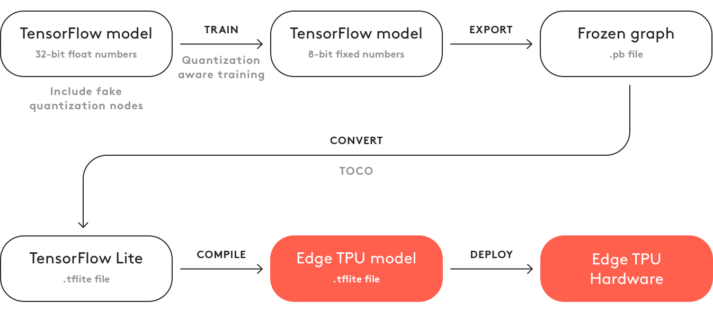
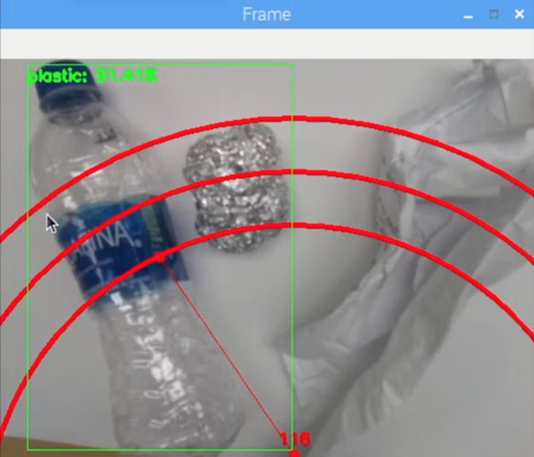
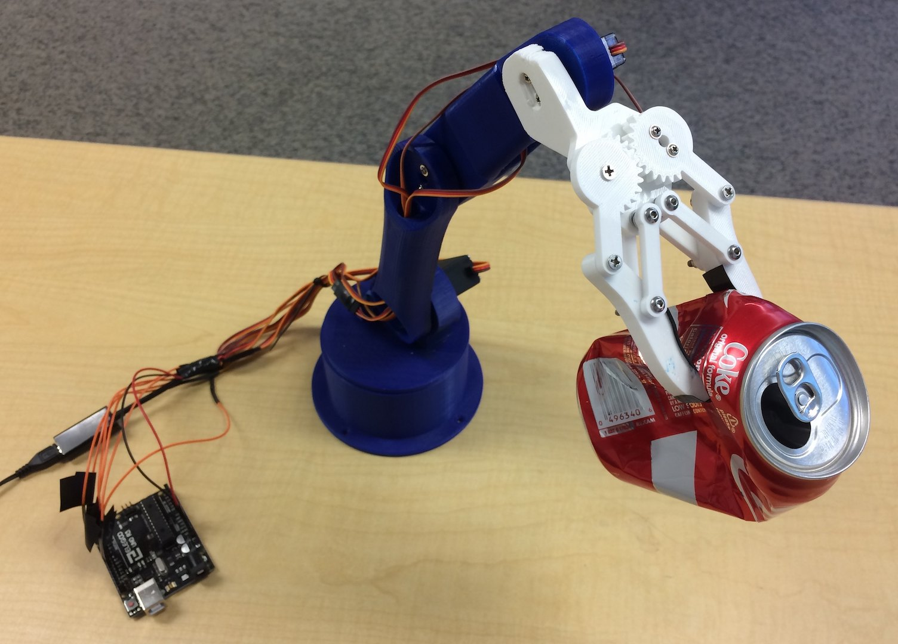
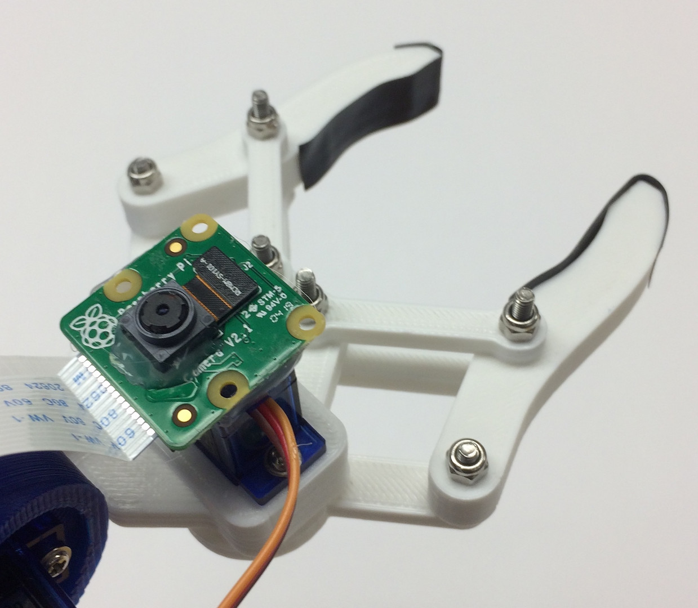
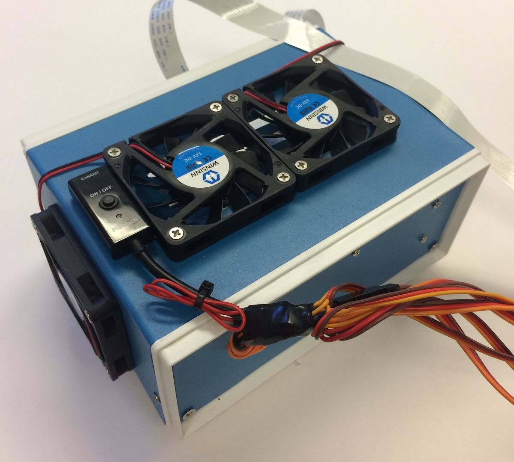
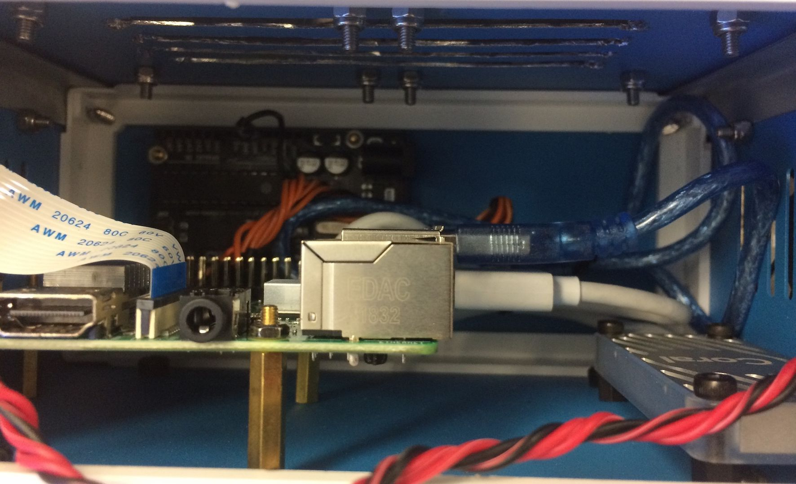

import ReactPlayer from 'react-player'

# Recycle Sorting Robotic Arm With Computer Vision

June 2019 - July 2019

**[GitHub Repository](https://github.com/bandofpv/Trash_Sorting_Robot)**

**[Hackster.io Tutorial](https://www.hackster.io/bandofpv/recycle-sorting-robot-with-google-coral-b52a92)**

## Story

Did you know that the average contamination rate in communities and businesses range up to 25%? That means one out of every four pieces of recycling you throw away doesn’t get recycled. This is caused due to human error in recycling centers. Traditionally, workers will sort through trash into different bins depending on the material. Humans are bound to make errors and end up not sorting the trash properly, leading to contamination. As pollution and climate change become even more significant in today’s society, recycling takes a huge part in protecting our planet. By using robots to sort through trash, contamination rates will decrease drastically, not to mention a lot cheaper and more sustainable. To solve this, I created a recycle sorting robot that uses machine learning to sort between different recycle materials.

<div align="center">

</div>

## Demo Video

<div className="video_wrapper">
    <ReactPlayer className="video_player" controls height="100%" width="100%" url="https://www.youtube.com/watch?v=dlkS8SC_BcU"/>
</div>

## Code

Please clone my GitHub [repository](https://github.com/bandofpv/Trash_Sorting_Robot) to follow along with this tutorial.

## Components List

|Qty|Component|
|:---|:---|
|x1|[Raspberry Pi RPI 4 4GB](https://www.amazon.com/CanaKit-Raspberry-4GB-Basic-Kit/dp/B07TXKY4Z9)|
|x1|[Google Coral USB Accelerator](https://www.amazon.com/Google-G950-01456-01-Coral-USB-Accelerator/dp/B07S214S5Y/ref=sr_1_3?keywords=Google+Coral&qid=1577038592&s=electronics&sr=1-3)|
|x1|[Arduino Uno R3](https://www.amazon.com/Arduino-A000066-ARDUINO-UNO-R3/dp/B008GRTSV6)|
|x1|[5V 2A DC Wall Power Supply](https://www.amazon.com/iMBAPrice-Adapter-Listed-Supply-5-Feet/dp/B00GUO5WUI/ref=sr_1_1?keywords=B00GUO5WUI&qid=1577038018&sr=8-1)|
|x1|[DC 12V Power Supply](https://www.amazon.com/R-Tech-UL-Listed-Switching-Supply-Adapter/dp/B00FEOB4EI/ref=sr_1_1?keywords=B00FEOB4EI&qid=1577038836&s=electronics&sr=1-1&th=1)|
|x1|[SG90 9g Micro Servos 4pcs.](https://www.amazon.com/Micro-Servos-Helicopter-Airplane-Controls/dp/B07MLR1498/ref=sr_1_1?keywords=sg90+servo&qid=1577038126&sr=8-1)|
|x1|[M3 x 0.5mm Stainless Steel Self-Lock Nylon Hex Lock Nut 100pcs.](https://www.amazon.com/100Pcs-Stainless-Self-Lock-Inserted-Clinching/dp/B075ZZW7VL/ref=sr_1_1?keywords=B075ZZW7VL&qid=1577038184&sr=8-1)|
|x1|[M3x20 Button Head Titanium Screws 10pcs.](https://www.getfpv.com/m3x20-button-head-titanium-screws-10pcs.html)|
|x1|[MG996R Metal Gear Torque Analog Servo Motor 4cs.](https://www.amazon.com/Seamuing-MG996R-Torque-Digital-Helicopter/dp/B07F7YZW7Q/ref=sr_1_1?keywords=B07F7YZW7Q&qid=1577038401&sr=8-1)|
|x1|[Samsung 32GB Select Memory Card](https://www.amazon.com/Samsung-MicroSDHC-Adapter-MB-ME32GA-AM/dp/B06XWN9Q99/ref=sr_1_1?keywords=B06XWN9Q99&qid=1577038479&sr=8-1)|
|x1|[Adafruit Flex Cable for Raspberry Pi Camera - 1 Meter](https://www.amazon.com/Adafruit-Flex-Cable-Raspberry-Camera/dp/B01BQUSQNU/ref=sr_1_1?keywords=B01BQUSQNU&qid=1577038681&s=electronics&sr=1-1)|
|x1|[M2 Male Female Brass Spacer Standoff Screw Nut Assortment Kit](https://www.amazon.com/HVAZI-270pcs-Female-Standoff-Assortment/dp/B01N1IUTVT/ref=sr_1_1?keywords=B01N1IUTVT&qid=1577038728&s=electronics&sr=8-1)|
|x1|[60mm 12V Fan](https://www.amazon.com/WINSINN-Brushless-Cooling-Computer-Graphics/dp/B07GX86CJN/ref=sr_1_1?keywords=B07GX86CJN&qid=1577038784&s=electronics&sr=1-1)|
|x1|[6.69"x 5.12" x 2.95" Project Box](https://www.amazon.com/ALCOMPRA-conexiones-170mm130mmx75mm-universal-Proyecto/dp/B07W5XLRZ2/ref=sr_1_1?keywords=B07BFBQFT6&qid=1577038764&s=electronics&sr=8-1)|
|x1|[Raspberry Pi Camera Module V2](https://thepihut.com/products/raspberry-pi-camera-module)|

## 3D Parts

|Qty|Part|
|:---|:---|
|x2|[Gripper](https://www.thingiverse.com/download:14552549)|
|x1|[Gripper Base](https://www.thingiverse.com/download:14552548)|
|x4|[Gipper Link](https://www.thingiverse.com/download:14552551)|
|x1|[Gear 1](https://www.thingiverse.com/download:14552545)|
|x1|[Gear 2](https://www.thingiverse.com/download:14552550)|
|x1|[Arm 1](https://www.thingiverse.com/download:14552554)|
|x1|[Arm 2](https://www.thingiverse.com/download:14552547)|
|x1|[Arm 3](https://www.thingiverse.com/download:14552544)|
|x1|[Waist](https://www.thingiverse.com/download:14552552)|
|x1|[Base](https://www.thingiverse.com/download:14552546)|

## Getting the Data

To train the object detection model that can detect and recognize different recycling materials, I used the [trashnet](https://github.com/garythung/trashnet) dataset which includes 2527 images:

+ 501 glass
+ 594 paper
+ 403 cardboard
+ 482 plastic
+ 410 metal
+ 137 trash

Here is an example image:

<div align="center">

</div>

This dataset is very small to train an object detection model. There are only about 100 images of trash that are too little to train an accurate model, so I decided to leave it out.

Make sure to download the [dataset-resized.zip](https://github.com/garythung/trashnet/tree/master/data) file. It contains the set of images that are already resized to a smaller size to allow for faster training. If you would like to resize the raw images to your own liking, feel free to download the dataset-original.zip file.

## Labeling the Images

Next, we need to label several images of different recycling materials so we can train the object detection model. To do this, I used [labelImg](https://github.com/tzutalin/labelImg), free software that allows you to label object bounding boxes in images.

Label each image with the proper label. [This](https://youtu.be/p0nR2YsCY_U) tutorial shows you how. Make sure to make each bounding box as close to the border of each object to ensure the detection model is as accurate as possible. Save all the .xml files into a folder.

Here is how to label your images:

<div align="center">

</div>

This is a very tedious & mind-numbing experience. Thankfully for you, I already labeled all the images for you! You can find it [here](https://github.com/bandofpv/Trash_Sorting_Robot/tree/master/Tensorflow/Images).

## Training

In terms of training, I decided to use [transfer learning](https://en.wikipedia.org/wiki/Transfer_learning) using Tensorflow. This allows us to train a decently accurate model without a large amount of data.

There are a couple of ways we can do this. We can do it on our local desktop machine on the cloud. Training on our local machine will take a super long time depending on how powerful your computer is and if you have a powerful GPU. This is probably the easiest way in my opinion, but again with the downside of speed.

There are some key things to note about transfer learning. You need to make sure that the pre-trained model you use for training is compatible with the Coral Edge TPU. You can find compatible models [here](https://coral.ai/models/). I used the MobileNet SSD v2 (COCO) model. Feel free to experiment with others too.

To train on your local machine, I would recommend following [Google's](https://coral.ai/docs/edgetpu/retrain-detection/) tutorial or [EdjeElectronics](https://github.com/EdjeElectronics/TensorFlow-Object-Detection-API-Tutorial-Train-Multiple-Objects-Windows-10) tutorial if running on Windows 10. Personally, I have tested EdjeElectroncs tutorial and reached success on my desktop. I can not confirm if Google's tutorial will work, but I would be surprised if it doesn't.

To train in the cloud, you can use AWS or GCP. I found [this](https://medium.com/tensorflow/training-and-serving-a-realtime-mobile-object-detector-in-30-minutes-with-cloud-tpus-b78971cf1193) tutorial that you can try. It uses Google's cloud TPU's that can train your object detection model super fast. Feel free to use AWS as well.

Whether you train on your local machine or in the cloud, you should end up with a trained tensorflow model.

## Compiling the Trained Model

In order for your trained model to work with the Coral Edge TPU, you need to compile it.

Here is a diagram for the workflow:

<div align="center">

</div>

After training, you need to save it as a frozen graph (.pb file). Then, you need to convert it into a Tensorflow Lite model. Note how it says "Post-training quantization". If you used the compatible pre-trained models when using transfer learning, you don't need to do this. Take a look at the full documentation on compatibility [here](https://coral.ai/docs/edgetpu/models-intro/).

With the Tensorflow Lite model, you need to compile it to an Edge TPU model. See details on how to do this [here](https://coral.ai/docs/edgetpu/models-intro/#compiling).

## Deploy the Model

The next step is to set up the Raspberry Pi (RPI) and Edge TPU to run the trained object detection model.

First, set up the RPI using [this](https://projects.raspberrypi.org/en/projects/raspberry-pi-setting-up/2) tutorial.

Next, set up the Edge TPU following [this](https://coral.ai/docs/accelerator/get-started/) tutorial.

Finally, connect the RPI camera module to the raspberry pi.

You are now ready to test your object detection model!

If you cloned my [repository](https://github.com/bandofpv/Trash_Sorting_Robot) already, you will want to navigate to the RPI directory and run the [test_detection.py](https://github.com/bandofpv/Trash_Sorting_Robot/blob/master/RPI/test_detection.py) file:

```bash
python test_detection.py --model recycle_ssd_mobilenet_v2_quantized_300x300_coco_2019_01_03/detect_edgetpu.tflite --labels recycle_ssd_mobilenet_v2_quantized_300x300_coco_2019_01_03/labels.txt
```

A small window should pop up and if you put a plastic water bottle or other recycle material, it should detect it like this:

<div align="center">

</div>

Press the letter "q" on your keyboard to end the program.

## Build the Robotic Arm

The robotic arm is a 3D printed arm I found [here](https://howtomechatronics.com/tutorials/arduino/diy-arduino-robot-arm-with-smartphone-control/). Just follow the tutorial on setting it up.

This is how my arm turned out:

<div align="center">

</div>

Make sure you connect the servo pins to the according to Arduino I/O pins in my code. Connect the servos from bottom to top of the arm in this order: 3, 11, 10, 9, 6, 5. Not connecting it in this order will cause the arm to move the wrong servo!

Test to see it working by navigating to the Arduino directory and running the [basicMovement.ino](https://github.com/bandofpv/Trash_Sorting_Robot/blob/master/Arduino/basicMovement/basicMovement.ino) file. This will simply grab an object that you place in front of the arm and drop it behind.

## Connecting the RPI and Robotic arm

We first need to mount the camera module to the bottom of the claw:

<div align="center">

</div>

Try to align the camera as straight as possible to minimize errors in grabbing the recognized recycle material. You will need to use the long camera module ribbon cable as seen in the materials list.

Next, you need to upload the [roboticArm.ino](https://github.com/bandofpv/Trash_Sorting_Robot/blob/master/Arduino/roboticArm/roboticArm.ino) file to the Arduino board.

Finally, we just have to connect a USB cable between the RPI's USB port and the Arduino's USB port. This will allow them to communicate via serial. Follow this [tutorial](https://www.sunfounder.com/blog/rpi-ard/) on how to set this up.

## Final Touches

This step is completely optional but I like to put all my components into a nice little project box.

Here is how it looks:

<div align="center">

</div>

<div align="center">

</div>

You can find the project box on the materials list. I just drilled some holes and used brass standoffs to mount the electronics. I also mounted 4 cooling fans to keep a constant airflow through the RPI and TPU when hot.

## Running

You are now ready to power on both the robotic arm and RPI! On the RPI, you can simply run the [recycle_detection.py](https://github.com/bandofpv/Trash_Sorting_Robot/blob/master/RPI/recycle_detection.py) file. This will open a window and the robotic arm will start running just like in the demo video! Press the letter "q" on your keyboard to end the program.

Feel free to play around with the code and have fun!

## Future Work

I hope to use R.O.S. to control the robotic arm with more precise movements. This will enable more accurate picking up of objects.
