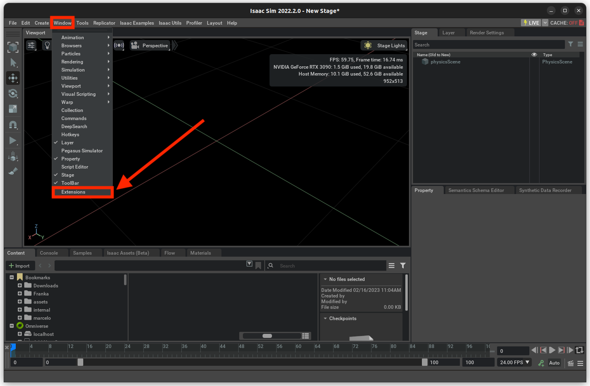
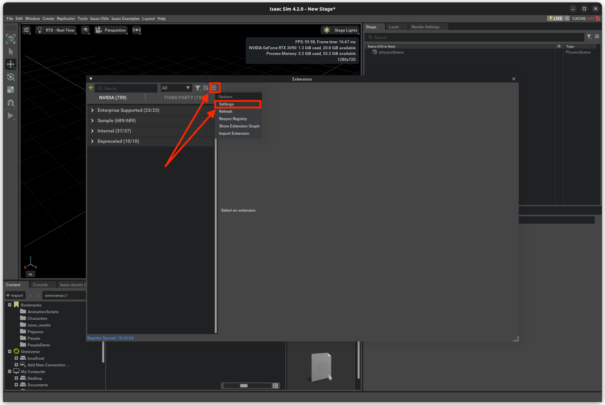
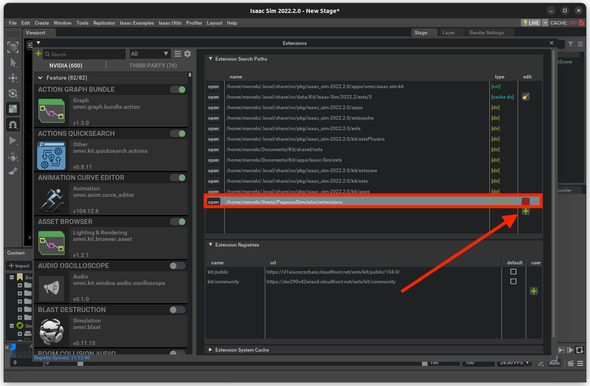
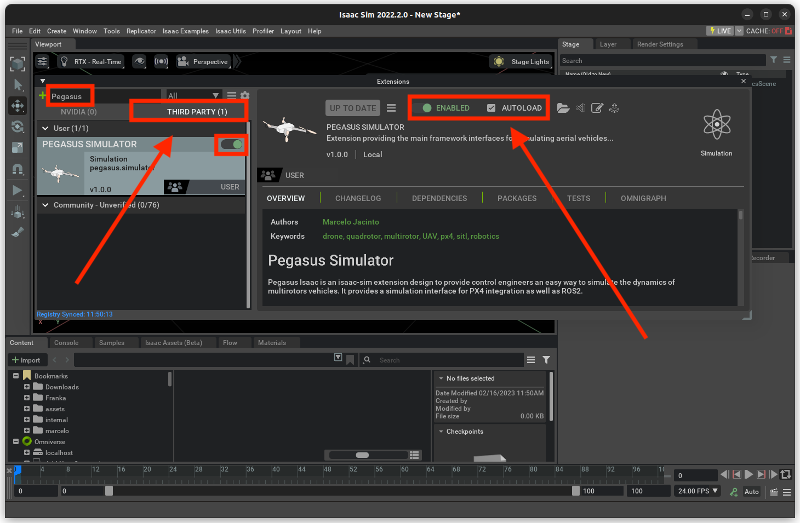
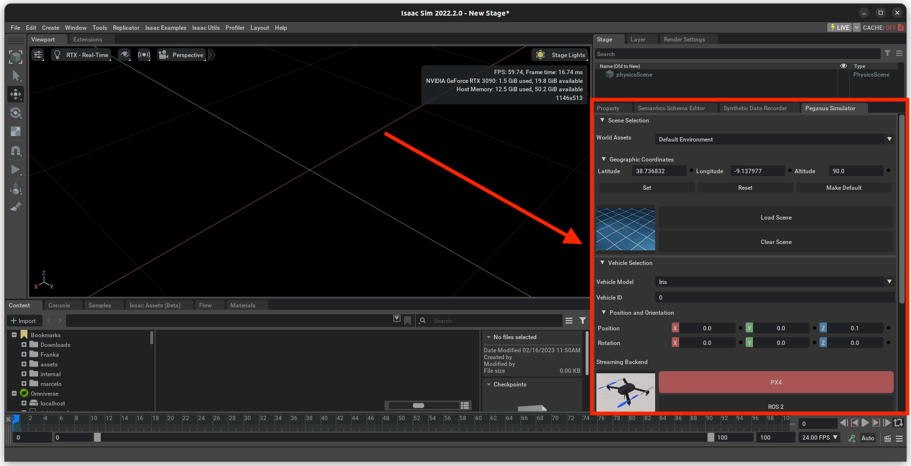
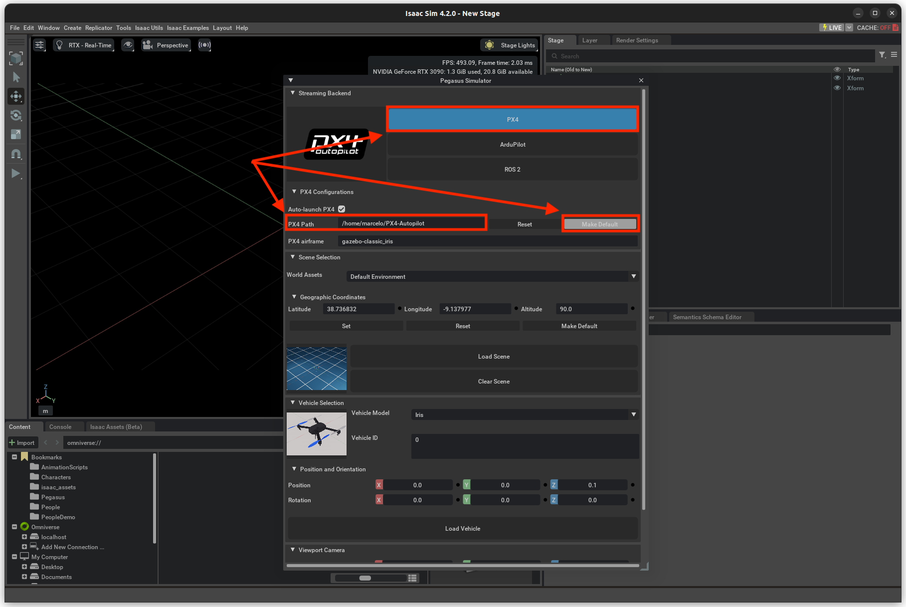

import Tabs from '@theme/Tabs';
import TabItem from '@theme/TabItem';
import ReactPlayer from 'react-player';

# Simulation

Simulating the VSLAM UAV pipeline is a great way to test your code without the need for a physical drone. This tutorial will show you how to set up the VSLAM UAV simulator on your local machine using [Docker](https://www.docker.com/) and [Isaac Sim 4.2](https://docs.omniverse.nvidia.com/isaacsim/latest/index.html).

## Prerequisites

Before you begin, make sure your workstation meets the following minimum requirements:

- **OS**: Ubuntu 22.04
- **CPU**: Intel Core i7 (7th Generation) / AMD Ryzen 5
- **CPU Cores**: 4
- **RAM**: 32GB
- **Storage**: 50GB SSD
- **GPU**: NVIDIA GeForce RTX 3070
- **GPU Driver**: NVIDIA Driver 550 or newer
- **VRAM**: 8GB

Please follow the official [NVIDIA Driver Installation](https://documentation.ubuntu.com/server/how-to/graphics/install-nvidia-drivers/index.html) instructions to install the latest NVIDIA driver.

Make sure you also install [Docker](https://docs.docker.com/engine/install/ubuntu/#install-using-the-repository) (recommended 27.2.0 or newer). It is also recommend you follow the [Linux Post-Installation Steps](https://docs.docker.com/engine/install/linux-postinstall/) as well to manage Docker as a non-root user.

You can verify your Docker installation via:

```bash
$ docker run hello-world
```

If you haven't already, clone the VSLAM UAV git repository:

```bash
$ cd ~
$ git clone https://github.com/bandofpv/VSLAM-UAV.git
```

## NVIDIA Container Toolkit

The [NVIDIA Container Toolkit](https://docs.nvidia.com/datacenter/cloud-native/container-toolkit/latest/install-guide.html) is required to run NVIDIA GPU-accelerated applications in Docker containers.

Configure the production repository:

```bash
$ curl -fsSL https://nvidia.github.io/libnvidia-container/gpgkey | sudo gpg --dearmor -o /usr/share/keyrings/nvidia-container-toolkit-keyring.gpg \
  && curl -s -L https://nvidia.github.io/libnvidia-container/stable/deb/nvidia-container-toolkit.list | \
    sed 's#deb https://#deb [signed-by=/usr/share/keyrings/nvidia-container-toolkit-keyring.gpg] https://#g' | \
    sudo tee /etc/apt/sources.list.d/nvidia-container-toolkit.list
```

Update the packages list from the repository:

```bash
$ sudo apt update
```

Install the NVIDIA Container Toolkit packages:

```bash
$ sudo apt install nvidia-container-toolkit
```

Configure the Docker container runtime by using the `nvidia-ctk` command:

```bash
$ sudo nvidia-ctk runtime configure --runtime=docker
```

Restart the Docker daemon:

```bash
$ sudo systemctl restart docker
```

Verify the installation by running a sample CUDA container:

```bash
$ sudo docker run --rm --runtime=nvidia --gpus all ubuntu nvidia-smi
```

## Install Isaac Sim

Start by downloading [Isaac Sim 4.2](https://docs.omniverse.nvidia.com/isaacsim/latest/index.html) which is the latest version supported by the Pegasus Simulator extension which is required to integrate a PX4 backend. Currently, the traditional method of installing Isaac Sim via the Omniverse Launcher is not supported and must be installed manually:

```bash
$ mkdir ~/isaacsim
$ cd ~/Downloads
$ wget https://download.isaacsim.omniverse.nvidia.com/isaac-sim-standalone%404.2.0-rc.18%2Brelease.16044.3b2ed111.gl.linux-x86_64.release.zip
$ unzip "isaac-sim-standalone@4.2.0-rc.18+release.16044.3b2ed111.gl.linux-x86_64.release.zip" -d ~/isaacsim
$ rm isaac-sim-standalone@4.2.0-rc.18+release.16044.3b2ed111.gl.linux-x86_64.release.zip
```

Next, install Isaac Sim by running the following commands one after another:

```bash
$ cd ~/isaacsim
$ ./omni.isaac.sim.post.install.sh
$ ./isaac-sim.selector.sh
```

:::note
These commands will take a while to run. Please don't close the terminal or interrupt the process.
:::

## Install Pegasus Simulator

[Pegasus Simulator](https://pegasussimulator.github.io/PegasusSimulator/index.html) is a Isaac Sim extension for the PX4 autopilot. It provides a realistic simulation environment for testing and developing autonomous drones.

Start by configuring the environment variables for Pegasus Simulator. Open a terminal and run the following commands:

```bash
$ cd ~/VSLAM-UAV/sim/setup
$ ./env_variables.sh
$ source ~/.bashrc
```

Check that the environment variables are set correctly by running the following command:

```bash
$ ISAACSIM
```

This should open the Isaac Sim application. If it does not, please check that the `ISAACSIM_PATH` variable is set correctly in your `~/.bashrc` file.

Next, we need to install the Pegasus Simulator extension. Open a terminal and clone the Pegasus Simulator repository:

```bash
$ cd ~
$ git clone https://github.com/PegasusSimulator/PegasusSimulator.git
```

Launch the Isaac Sim application and open the Window->extensions on the top menu bar:

<div align="center">
  
</div>

In the Extensions window, click on the `Options` icon and select `Settings` to add a path to the Pegasus Simulator repository:

<div align="center">
  
</div>

Insert the path to the Pegasus Simulator repository followed by `/extensions` in the `Extension Search Paths` field:

<div align="center">
  
</div>

Next, enable the `Pegasus Simulator` extension in the third-party extensions tab and enable autoload:

<div align="center">
  
</div>

Verify that the extension is loaded by checking the Pegasus Simulator window on the bottom right of the Isaac Sim application:

<div align="center">
  
</div>

Now, install the Pegasus Simulator as a Python module to use it in Python scripts. Open a terminal and run the following commands:

```bash
$ cd ~/PegasusSimulator/extensions
$ ISAACSIM_PYTHON -m pip install --editable pegasus.simulator
```

Check that you can launch the simulator from a python script (standalone mode):

```bash
$ ISAACSIM_PYTHON ${ISAACSIM_PATH}/standalone_examples/api/omni.isaac.core/add_cubes.py
```

This should open the Isaac Sim application and add cubes to the world.

Run the following command to add the custom VSLAM UAV model to the Pegasus Simulator extension:

```bash
$ cd ~/VSLAM-UAV/sim/setup
$ ./sim_assets.sh
```

## Install PX4-Autopilot

If you wish to use the Pegasus Simulator GUI (in extension mode), you must install PX4-Autopilot:

Start by installing the required dependencies:

```bash
$ sudo apt install git make cmake python3-pip
$ pip install kconfiglib jinja3 jsonschema pyros-genmsg packaging toml numpy future empy==3.3.4
```

Next, clone the PX4-Autopilot repository:

```bash
$ cd ~
$ git clone https://github.com/PX4/PX4-Autopilot.git
```

Check out the latest stable release:

```bash
$ cd ~/PX4-Autopilot
$ git checkout v1.14.3
$ git submodule update --init --recursive
```

Compile the PX4-Autopilot source code:

```bash
$ make px4_sitl_default none
```

Press **CTRL+C** upon seeing the following message:

```bash
[100%] Built target px4
```

Open Isaac Sim and provide the path to the PX4-Autopilot repository in the `PX4 Path` field in the Pegasus Simulator window. Press the `Make Default` button to set the PX4-Autopilot path as the default path for the Pegasus Simulator:

<div align="center">
  
</div>

## Install QGroundControl

[QGroundControl](https://docs.qgroundcontrol.com/master/en/) is a ground control station (GCS) for drones. It provides a user interface for controlling and monitoring the drone.

First, open a terminal and run the following commands to install dependencies:

```bash
$ sudo usermod -a -G dialout $USER
$ sudo apt-get remove modemmanager -y
$ sudo apt install gstreamer1.0-plugins-bad gstreamer1.0-libav gstreamer1.0-gl -y
$ sudo apt install libfuse2 -y
$ sudo apt install libxcb-xinerama0 libxkbcommon-x11-0 libxcb-cursor-dev -y
```

Logout and login again to enable the change to user permissions.

Next, download the latest [QGroundControl.AppImage](https://d176tv9ibo4jno.cloudfront.net/latest/QGroundControl.AppImage).

Make the AppImage executable:

```bash
$ chmod +x QGroundControl.AppImage
```

You can run QGroundControl by double-clicking on the AppImage file or by running the following command in the terminal:

```bash
$ ./QGroundControl.AppImage
```

## Install Isaac ROS

VSLAM UAV utilizes the [Isaac ROS Visual SLAM](https://nvidia-isaac-ros.github.io/repositories_and_packages/isaac_ros_visual_slam/index.html) package for the VSLAM pipeline. This is a ROS 2 package that provides a set of tools and libraries for building and deploying visual SLAM applications.

Start by installing Git LFS to pull down large files:

```bash
$ sudo apt-get install git-lfs
$ git lfs install --skip-repo
```

Next, create a workspace for Isaac ROS:

```bash
$ mkdir -p  ~/workspaces/isaac_ros-dev/src
$ echo "export ISAAC_ROS_WS=${HOME}/workspaces/isaac_ros-dev/" >> ~/.bashrc
$ source ~/.bashrc
```

Next, clone the Isaac ROS Visual SLAM repository:

```bash
$ cd ${ISAAC_ROS_WS}/src
$ git clone -b release-3.2 https://github.com/NVIDIA-ISAAC-ROS/isaac_ros_common.git isaac_ros_common
```

Install the required packages:

```bash
$ sudo apt-get install -y curl jq tar
```

Then, download the required `isaac_ros_visual_slam` assets:

```bash
$ cd ${ISAAC_ROS_WS}
$ git clone https://github.com/bandofpv/VSLAM-UAV.git
$ cd ${ISAAC_ROS_WS}/VSLAM-UAV/setup
$ ./isaac_vslam_assets.sh
```

You can now build the Isaac ROS Docker image:

```bash
$ cd ${ISAAC_ROS_WS}/src/isaac_ros_common && \
$ ./scripts/run_dev.sh
```

This script will automatically build the Docker image and open it in a Docker container.

## VSLAM UAV Docker Image

You can now build the VSLAM UAV Simulation Docker image via the following commands:

```bash
$ cd ~/VSLAM-UAV/docker/sim
$ ./run_docker.sh
```

This script will automatically build the Docker image and open it in a Docker container.

## Launch Simulation

Open QGroundControl via the AppImage file you downloaded earlier.

Next, in a new terminal, open the VSLAM UAV Simulation Docker container:

```bash
$ cd ~/VSLAM-UAV/docker/sim
$ ./run_docker.sh
```

Inside the Docker container, launch [mavrospy](https://github.com/bandofpv/mavrospy/tree/ros2):

```bash
$ cd ~/VSLAM-UAV/sim
$ ros2 launch mavrospy.launch.py
```

:::info
You can specify the flight pattern via the `pattern` argument. If unspecified, it will default to `square`.

```bash
$ ros2 launch mavrospy.launch.py pattern:=spiral
```

Available Patterns: `square`, `square_head`, `circle`, `circle_head`, `figure8`, `figure8_head`, `spiral`, and `spiral_head`. Where `_head` will specify the drone to face in the direction of motion.
:::

In a new terminal, open the Isaac ROS Docker container:

```bash
$ cd ${ISAAC_ROS_WS}/src/isaac_ros_common
$ ./scripts/run_dev.sh -b
```

Then, initialize the Isaac ROS Visual SLAM pipeline:

```bash
$ cd /workspaces/isaac_ros-dev/VSLAM-UAV/sim
$ ./isaac_ros_vslam.sh
```

In a new terminal, run Isaac Sim:

```bash
$ cd ~/VSLAM-UAV/sim
$ ISAACSIM_PYTHON isaac_sim.py
```

Isaac Sim will open up and display a quadcopter model. The simulator will automatically connect to your QGroundControl application. Look for `Received first heartbeat` at the bottom of the window.

Navigate to your QGroundControl application and click on the text that says `Hold` to change the mode to `Offboard`.

Go back to the Isaac Sim window and watch drone fly!

You can close the Isaac Sim window using the **x** at the top right and press **CTRL+C** in the MAVROSPY container to close the simulation.

## UPDATE VIDEO

<div className="video_wrapper">
    <ReactPlayer className="video_player" controls height="100%" width="100%" url=""/>
</div>

## Visualization with Rviz

You can also visualize our simulation poses with [Rviz](https://docs.ros.org/en/humble/p/rviz2/doc/index.html).

After launching Isaac Sim, we can launch Rviz.

Open a new termial and attach to the VSLAM UAV Simulation Docker container:

```bash
$ cd ~/VSLAM-UAV/docker/sim
$ ./run_docker.sh
```

Launch Rviz:

```bash
$ cd ~/VSLAM-UAV/sim
$ ros2 launch rviz.launch.py
```
Rviz will automatically begin plotting the drone's path.

**CTRL+C** to exit.

## UPDATE VIDEO

<div className="video_wrapper">
    <ReactPlayer className="video_player" controls height="100%" width="100%" url=""/>
</div>
