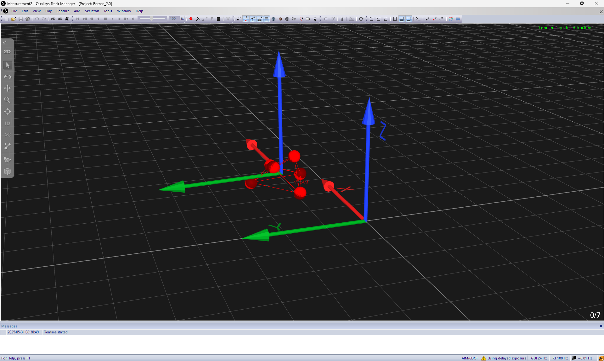

import ReactPlayer from 'react-player'

# Validation

This page outlines an optional procedure that can be used to validate the successful installation and configuration of your VSLAM system. It requires the use of a motion capture system to provide ground truth data. 

My personal lab setup uses a Qualisys motion capture system, but you can use any of the following:

- VICON
- Qualisys
- OptiTrack
- VRPN
- NOKOV
- FZMotion
- Motion Analysis

## Data Collection

Before starting the validation procedure, ensure that your motion capture system is properly calibrated and that you can stream ground truth data for the quadcopter's rigid body position and orientation.

First, start the motion capture system and begin streaming the ground truth data. It is important that you align the quadcopter's rigid body with the axis you calibrated in the motion capture system.



Then, modify the motion capture configuration file on your desktop computer to specify your motion capture system and the IP address of your streaming server. Open the file `cfg.yaml`:

```bash
$ nano ~/VSLAM-UAV/docker/analysis/cfg.yaml
```

First, set the `type` to your motion capture system. For example, if you are using a Qualisys system, set it as follows:

```yaml
type: "qualisys"
```

The available options are: `optitrack`, `optitrack_closed_source`, `vicon`, `qualisys`, `nokov`, `vrpn`, and `motionanalysis`.

Next, set the `hostname` to the IP address of your motion capture server:

```yaml
hostname: "10.24.5.189"
```

You can now start publishing. Start by launching the `analysis` docker container:

```bash
$ cd ~/VSLAM-UAV/docker/analysis && \
  ./run_docker.sh
```

Next, start the motion capture ROS node:

```bash
$ ros2 launch motion_capture_tracking launch.py
```

Then, follow the [Flight Demo Procedure](/docs/tutorials/robots/vslam/flight#procedure).

Before taking off, begin the data collection by running the following command in a new terminal on your desktop computer:

```bash
$ cd ~/VSLAM-UAV/docker/analysis && \
  ./run_docker.sh
$ cd ~/VSLAM-UAV/validation
$ ros2 bag record -o validation_data \
    /visual_slam/tracking/vo_pose_covariance \
    /poses
```

Once you have completed the flight, stop the data collection by pressing `Ctrl+C` in the terminal where you started the `ros2 bag record` command.

## Validation

Validation is performed by comparing the VSLAM system's pose estimates with the ground truth data from the motion capture system.

Start by parsing the recorded data. In the `analysis` docker container, run the following commands:

```bash
$ cd ~/VSLAM-UAV/validation
$ python3 parse_rosbag.py --name validation_data
```

This will create two CSV files: `ground_truth.csv` and `vslam_estimates.csv`. These files contain the ground truth pose data and the VSLAM system's pose estimates, respectively.

Next, you can visualize the results using the `validation.py` script in the `analysis` docker container:

```bash
$ cd ~/VSLAM-UAV/validation
$ python3 validation.py
```
This script will load the parsed data and plot the ground truth and VSLAM pose estimates in 3D. It will also calculate the root mean square error (RMSE) for both the position and orientation estimates.
