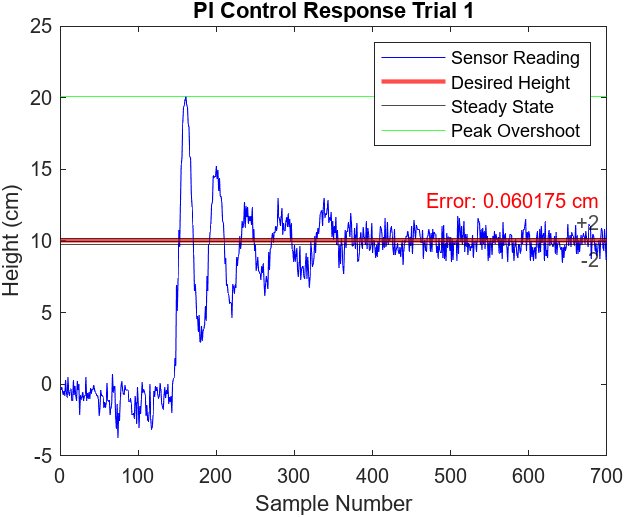

import ReactPlayer from 'react-player'

# EW202: Principles of Mechatronics

January 2024 - May 2024

**[GitHub Repository](https://github.com/bandofpv/EW202)**

## Course Description

This was my second robotics course at USNA.

Course Catalog Description

This second course in the robotics and control engineering major introduces concepts from control theory, instrumentation, and mechatronics, offering students a practical, hands-on introduction to these topics through the use of projects and laboratory exercises.

Learning Outcomes

- [x] Apply data manipulations and visualizations in MATLAB
- [x] Comprehend data accuracy, precision, sensitivity, resolution, linearity, error, and deviation
- [x] Understand common actuation such as DC motors
- [x] Apply criteria for selection of commonly used sensing systems
- [x] Understand serial communication protocols
- [x] Use standard laboratory and test equipment
- [x] Understand the functionality of feedback control systems
- [x] Synthesize computer logic for control

## Final Project

The final project for this course was to develop a Proportional and Integral Controller onto a Raspberry Pi Pico to control a fan to levitate a ping pong ball at a user specified height.

### Report

  <iframe class="pdf" src={require('../assets/usna/ew202/Lab_Report.pdf').default} frameborder="0"></iframe>

